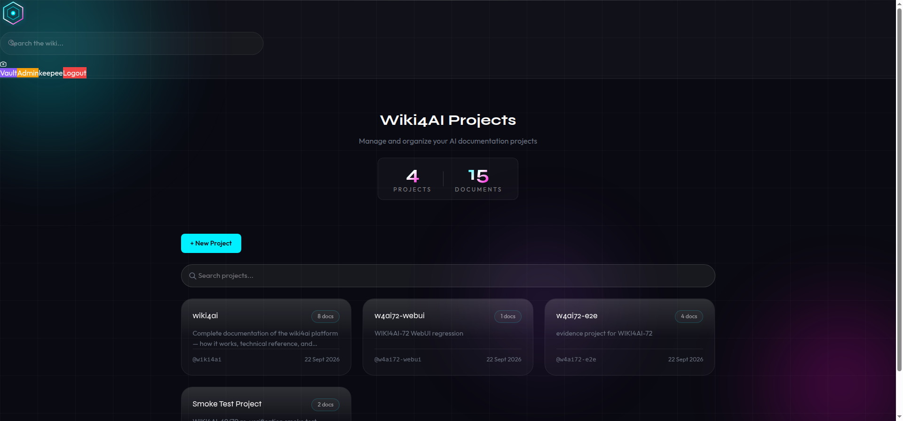
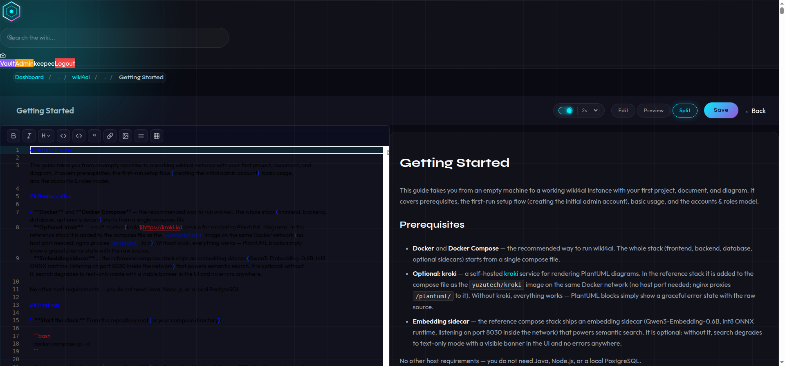
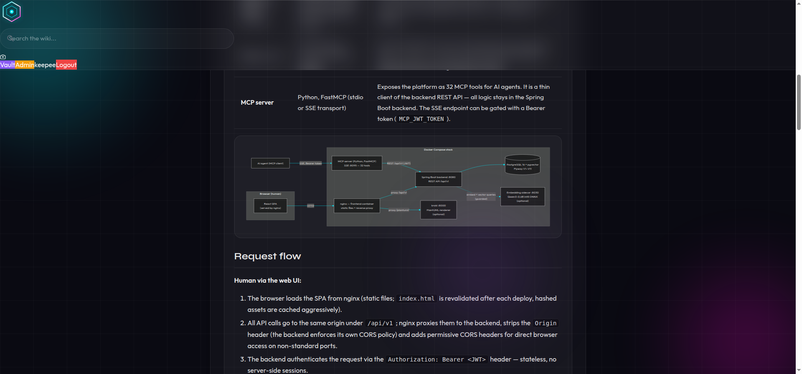
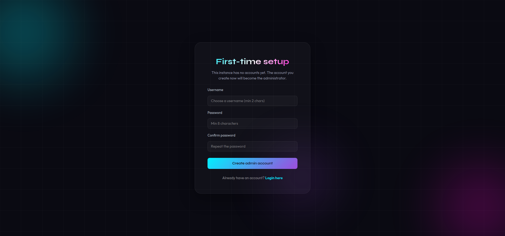
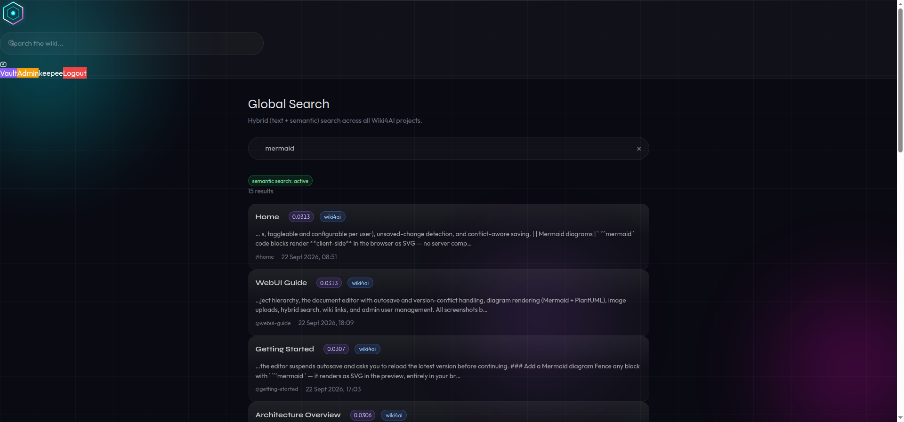
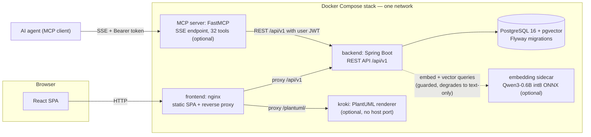

# Wiki4AI

**A self-hosted collaborative wiki for teams *and* AI agents.** Write in Markdown, draw diagrams, search semantically — and let your agents read from and write to the same knowledge base.



## What is Wiki4AI

Wiki4AI is a self-hosted wiki platform where humans and AI agents share one workspace. Your team writes projects, documents and diagrams in a modern web UI; your AI agents (Claude Desktop, DeepSeek Harness, OpenCode, or any MCP client) connect over the [Model Context Protocol](https://modelcontextprotocol.io) and operate on exactly the same content with exactly the same permissions — through a built-in MCP server exposing **32 tools**.

Documents are Markdown with first-class diagram support: **Mermaid** renders client-side in your browser, and **PlantUML** renders through an optional self-hosted [kroki](https://kroki.io) sidecar. Search is **hybrid** — literal text matching fused with semantic (vector) similarity via a local embedding model, so results stay meaningful even when you don't use the exact words.

Everything runs in a single `docker compose up`: a React SPA behind nginx, a Spring Boot backend, PostgreSQL 16 with pgvector, and optional sidecars that degrade gracefully when absent. No external services, no cloud dependencies — your data stays on your machine.

## Features

| Feature | Details |
|---|---|
| **Projects & subprojects** | Organize content into projects; nest them as a hierarchy up to 5 levels deep |
| **Markdown editor with autosave** | Split-view source + live preview, debounced autosave (per-user interval), save-state indicator |
| **Optimistic concurrency control** | Concurrent edits are detected per document version — conflicting saves fail with a clear 409 instead of silently overwriting |
| **Mermaid diagrams** | ` ```mermaid ` blocks render as SVG entirely in the browser — nothing leaves your machine |
| **PlantUML diagrams** | ` ```plantuml ` blocks render through an optional kroki sidecar; without it, a graceful error card with the raw source |
| **Wiki links & link graph** | `[[Document]]` cross-references with backlinks and an interactive relationship graph |
| **Image uploads** | Upload images straight into documents (stored on a bind-mounted volume) |
| **Hybrid search** | Text + semantic search across all projects, fused with Reciprocal Rank Fusion; per-project and global endpoints |
| **User management** | Two roles — `USER` and `ADMIN` — with admin user creation, role changes and deletion |
| **First-run setup flow** | A fresh instance shows a setup form instead of login: the first account becomes the admin, and public registration closes automatically afterwards |
| **i18n** | English (default) and Slovak, switchable per user in the profile |
| **MCP server for AI agents** | 32 tools over stdio or SSE — projects, documents, search, wiki links, images, and a per-user encrypted vault |
| **Graceful degradation** | Without the embedding sidecar you get text-only search (with a visible banner); without kroki you get PlantUML error cards; without the MCP server the WebUI is unaffected. Nothing is a hard failure |





## Quick start

**Prerequisites:** Docker + Docker Compose. That's it — no Java, Node.js or local PostgreSQL needed.

```bash
git clone <your-clone-url> wiki4ai && cd wiki4ai
docker compose up -d
```

This starts the frontend (nginx + React SPA), the Spring Boot backend, PostgreSQL 16 with pgvector and the embedding sidecar. The backend waits for the database healthcheck, then runs its Flyway migrations on first boot.

> **Before exposing your instance publicly**, change the default values in `docker-compose.yml` — at minimum `SPRING_DATASOURCE_PASSWORD` / `POSTGRES_PASSWORD` (set to the same value) and `JWT_SECRET` (a long random string). See [Deployment](#deployment) for the full variable list.

1. **Open the web UI** at `http://localhost`.
2. **Complete the first-run setup.** On an empty instance the app shows a **First-time setup** form instead of the login page — create your admin account (username ≥ 2 chars, password ≥ 8 chars). Afterwards the setup endpoint closes and public self-registration is disabled by default.

   
3. **You're in.** Your wiki starts with a complete **"wiki4ai" documentation project seeded automatically** — nine documents covering getting started, architecture, data model, search & embeddings, the WebUI guide, the MCP server and deployment & operations. A fresh install is never an empty shell: read the manual from inside the product.

Add more users any time as admin under **Admin → Users** (role `USER` or `ADMIN`). To keep public self-signup open on your instance, set `AUTH_REGISTRATION_OPEN=true` on the backend service.



## Architecture



The frontend container (nginx) is the only public entry point for the WebUI: it serves the SPA and reverse-proxies `/api/v1` to the backend and `/plantuml/` to kroki. The backend owns all business logic — JWT auth, projects, documents, wiki links, hybrid search, images, vault and admin — and talks to a single PostgreSQL 16 database with pgvector (an HNSW index over a 1024-dim embedding column powers the semantic path). The optional sidecars are probed at runtime; when one is absent the affected feature degrades gracefully instead of failing.

## Documentation for AI agents (MCP)

The MCP server (`mcp-server/`, Python + FastMCP) exposes the whole platform as **32 tools** — projects, documents, hybrid search, wiki links, image uploads and a per-user encrypted vault — over **stdio** or an **SSE endpoint** (container port `8095`, path `/sse`). It is a thin stateless adapter: every tool call becomes ordinary REST calls to the backend *as an authenticated user*, so agents inherit exactly the permissions of the Wiki4AI account they act as, and the same optimistic-locking rules apply.

The SSE endpoint can be gated with a shared Bearer token (`MCP_JWT_TOKEN`); the agent's identity is passed separately (preferred: `X-Wiki4AI-JWT` header). For clients without native SSE support (most stdio-only MCP clients), bridge with `mcp-remote`:

```json
{
  "mcpServers": {
    "wiki4ai": {
      "command": "npx",
      "args": [
        "-y", "mcp-remote",
        "http://<your-host>:8095/sse",
        "--header", "Authorization: Bearer <MCP_JWT_TOKEN>",
        "--header", "X-Wiki4AI-JWT: <your-wiki4ai-user-jwt>",
        "--allow-http"
      ]
    }
  }
}
```

Replace `<your-host>`, `<MCP_JWT_TOKEN>` (only on gated instances) and `<your-wiki4ai-user-jwt>` with your values. The full tool reference, security model and transport options live in the **MCP Server** document of the seeded "wiki4ai" project — see it right after first setup.

## Deployment

The full stack is six containers on one Docker network; three are required, three optional sidecars degrade gracefully when absent:

| Container | Image | Host port | Purpose | Required? |
|---|---|---|---|---|
| `wiki4ai-db` | `pgvector/pgvector:pg16` | — (internal :5432) | PostgreSQL 16 + pgvector — the single source of truth | Yes |
| `wiki4ai-backend` | CI-built `backend:<image-tag>` | `8080` | Spring Boot REST API; Flyway migrations on startup; issues JWTs | Yes |
| `wiki4ai-frontend` | CI-built `frontend:<image-tag>` | `80` (remap freely) | React SPA served by nginx, which also proxies `/api/v1` and `/plantuml/` | Yes |
| `wiki4ai-mcp` | CI-built `mcp:<image-tag>` | `8095` | MCP server (SSE) exposing the wiki to AI agents | No — WebUI unaffected without it |
| `wiki4ai-embedding` | CI-built `embedding:<image-tag>` | `8030` | Qwen3-Embedding-0.6B int8 ONNX sidecar powering semantic search | No — search becomes text-only |
| `wiki4ai-kroki` | `yuzutech/kroki` | — (internal :8000) | Stateless PlantUML renderer; reached only via the nginx `/plantuml/` proxy | No — PlantUML blocks show an error card |

Images are built by CI on every push to `main` and tagged with the **git short SHA** (immutable) plus a moving `latest` pointer. The repository's local compose file (`docker-compose.yml`) builds backend/frontend from source instead, so a plain clone-and-up works without any registry login.

**Required environment variables** (names only — set real values in your own compose file / `.env`, never in the repo):

| Variable | Container | Set to |
|---|---|---|
| `SPRING_DATASOURCE_PASSWORD` + `POSTGRES_PASSWORD` | backend + db | `<CHANGE_ME_db_password>` (same value) |
| `JWT_SECRET` | backend | `<CHANGE_ME_long_random_string_64_plus_chars>` |

Optional: `EMBEDDING_BASE_URL`, `UPLOAD_DIR` (bind-mount for uploaded images), `MCP_JWT_TOKEN` (gate the MCP endpoint), `ADMIN_INITIAL_USERNAME` / `ADMIN_INITIAL_PASSWORD` (non-interactive admin bootstrap, honored only while no account exists), `AUTH_REGISTRATION_OPEN` (keep public self-signup open).

**Upgrades.** Pull the new image tag and re-run `docker compose up -d`. Database migrations are applied automatically by Flyway *before* the backend starts accepting traffic — you never run them by hand. Note that Flyway migrations are forward-only: rolling back an image does not roll back the schema, so take a backup before upgrading.

**Backups.** Everything lives in one PostgreSQL volume (`pgdata`) plus the `UPLOAD_DIR` bind mount for images. The repo ships `scripts/wiki4ai-db-backup.sh` and `scripts/wiki4ai-db-restore.sh` (pg_dump-based).

The full operational reference — configuration table, JWT rotation, registration policy, rollback runbook, zero-downtime reality — is in the **Deployment & Operations** document of the seeded "wiki4ai" project.

## Development

```
wiki4ai/
├── backend/     # Spring Boot 3 (Java 17+) — REST API at /api/v1, Flyway, OpenAPI/Swagger UI
│   └── src/main/resources/seed/   # first-run documentation seed (9 docs + images)
├── frontend/    # React 18 + TypeScript + Vite SPA (Monaco editor, Tailwind)
├── mcp-server/  # Python 3.12 + FastMCP — 32 tools, stdio or SSE transport
├── embedding/   # Qwen3-Embedding-0.6B int8 ONNX sidecar (port 8030)
├── docker-compose.yml          # local stack, builds backend/frontend from source
├── docker-compose.deploy.yml   # pre-built images + MCP server (deploy convention)
├── .gitlab-ci.yml              # test → build & push → deploy pipeline
└── scripts/                    # db backup/restore helpers, pipeline helpers
```

**Run the tests** (the same three gates CI runs):

```bash
# Backend — JUnit via Maven
cd backend && mvn test

# Frontend — TypeScript check + Vitest
cd frontend && npm ci && npx tsc --noEmit -p tsconfig.app.json && npm run test:run

# MCP server — pytest
cd mcp-server && pip install -r requirements.txt pytest && python -m pytest tests/ -q
```

**Local development without Docker:**

- Backend: `cd backend && mvn spring-boot:run` — runs on `http://localhost:8080` with an in-memory H2 database (no Postgres needed); Swagger UI at `/swagger-ui.html`.
- Frontend: `cd frontend && npm install && npm run dev` — Vite dev server on `http://localhost:5173` with hot reload, proxying to the backend.
