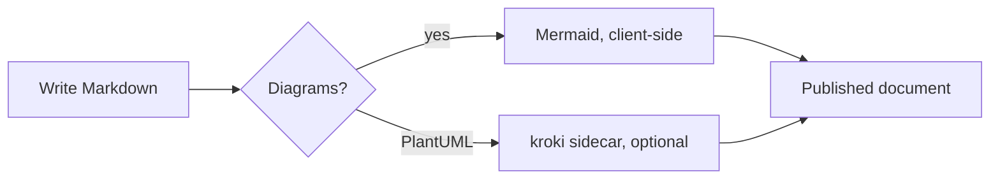

# Getting Started

This guide takes you from an empty machine to a working wiki4ai instance with your first project, document, and diagram. It covers prerequisites, the first-run setup flow (creating the initial admin account), basic usage, and the accounts & roles model.

## Prerequisites

- **Docker** and **Docker Compose** — the recommended way to run wiki4ai. The whole stack (frontend, backend, database, optional sidecars) starts from a single compose file.
- **Optional: kroki** — a self-hosted [kroki](https://kroki.io) service for rendering PlantUML diagrams. In the reference stack it is added to the compose file as the `yuzutech/kroki` image on the same Docker network (no host port needed; nginx proxies `/plantuml/` to it). Without kroki, everything works — PlantUML blocks simply show a graceful error state with the raw source.
- **Embedding sidecar** — the reference compose stack ships an embedding sidecar (Qwen3-Embedding-0.6B, int8 ONNX runtime, listening on port 8030 inside the network) that powers semantic search. It is optional: without it, search degrades to text-only mode with a visible banner in the UI and no errors anywhere.

No other host requirements — you do not need Java, Node.js, or a local PostgreSQL.

## First run

1. **Start the stack.** From the repository root (or your compose directory):

   ```bash
   docker compose up -d
   ```

   This brings up the frontend (nginx + React SPA), the Spring Boot backend, PostgreSQL 16 with pgvector, and the embedding sidecar. The backend waits for the database healthcheck before starting, and runs Flyway migrations on first boot (schema V1–V11).

2. **Open the web UI** in your browser: `http://<host>:<port>` (port 80 in the reference compose; the dev stack maps it to 3016).

3. **Complete the first-run setup.** On an empty instance (no accounts yet), the app probes `GET /api/v1/auth/status`; while `initialized` is `false`, the WebUI shows the **Setup** form instead of the login page. Enter a username and password:
   - Username: at least 2 characters.
   - Password: at least 8 characters (the form validates both client-side; the backend re-validates).

   Submitting calls `POST /api/v1/auth/setup`, which creates **the first account with the ADMIN role**. This is the only way to initialize a fresh instance interactively — afterwards the setup endpoint returns `403` and the form disappears from the UI.

   > Alternative: you can provision the initial admin non-interactively by setting the `ADMIN_INITIAL_USERNAME` / `ADMIN_INITIAL_PASSWORD` environment variables on the backend service. They are honored **only while the users table is empty**, and there are no built-in defaults — a fresh instance must never ship with publicly known credentials.

4. **Registration closes automatically.** Once the first account exists, public self-registration (`POST /api/v1/auth/register`) is closed by default (subsequent attempts get `403`). If you want an open sign-up page on your instance, opt in explicitly by setting `auth.registration.open=true` (env `AUTH_REGISTRATION_OPEN=true`) on the backend.

5. **Add further users (admin).** Log in with your admin account and go to **Admin → Users**. There you can create new accounts with either role (**USER** or **ADMIN**), change a user's role, or delete a user.

## Basic usage

### Create a project

From the dashboard, click **New Project**, give it a name and an optional description, and save. The platform generates a URL-friendly slug from the name (e.g. `My Wiki` → `my-wiki`). Projects can also be created as **subprojects** of another project (up to 5 levels deep); the project tree is visible in the dashboard navigation.

### Create a document

Open the project and click **New Document**. Enter a title — its slug is generated the same way — and start writing Markdown in the split-view editor (source on the left, live preview on the right).

### Edit with autosave

The editor autosaves debounced changes (default every 2 seconds; the interval and the toggle are per-user preferences stored in your browser). The save indicator shows `saving` / `saved` / `unsaved` states. If a document is modified by another session while you edit, the next save fails with a **409 conflict** instead of overwriting: the editor suspends autosave and asks you to reload the latest version before continuing.

### Add a Mermaid diagram

Fence any block with ` ```mermaid ` — it renders as SVG in the preview, entirely in your browser:

````markdown

````

PlantUML blocks (` ```plantuml `) work the same way in the editor but render through the optional kroki service.

### Search

- **Global search** (top navigation bar) searches across all projects and returns results with project attribution, relevance score, and an excerpt. It requires a logged-in account.
- **Per-project search** is available on each project page.
- Both are hybrid: literal text matching plus semantic similarity when the embedding sidecar is running. When it is not, you get a banner telling you that only text results are shown — never an error.

## Accounts & roles

wiki4ai has two built-in roles. Permissions combine the role with per-project grants:

| Capability | USER | ADMIN |
|---|---|---|
| Read any project / document (logged in) | Yes — wiki convention: every authenticated user can read everything | Yes |
| Use global & per-project search | Yes | Yes |
| Create projects | Yes — creator implicitly gets MANAGE on the new project | Yes |
| Create / edit / delete documents in a project | Only where explicitly granted (CREATE/UPDATE/DELETE permissions) | Yes, everywhere (role bypasses project-level checks) |
| Manage per-project permission grants (MANAGE) | Only where explicitly granted | Yes, everywhere |
| Manage users (create, change role, delete) — Admin → Users | No | Yes |
| Run embedding backfill / admin operations | No | Yes |

Notes:

- The **first account created through the setup flow is always ADMIN**.
- An ADMIN's privileges are system-wide; per-project permission grants are unnecessary (but harmless) for them.
- Every authenticated user can read all projects — wiki4ai's access model is "read-everything, write-by-grant". If you need stricter isolation, that is a deployment-level concern (see [[Deployment & Operations]]).

## Next steps

- Understand how everything fits together: [[Architecture Overview]].
- Browse the REST API your browser and agents use: [[Backend API Reference]].
- Wire up an AI agent to this instance: [[MCP Server]].
