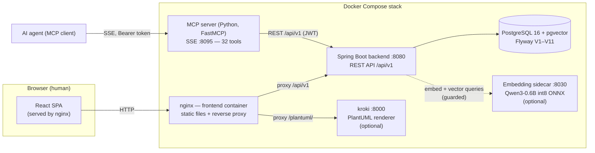
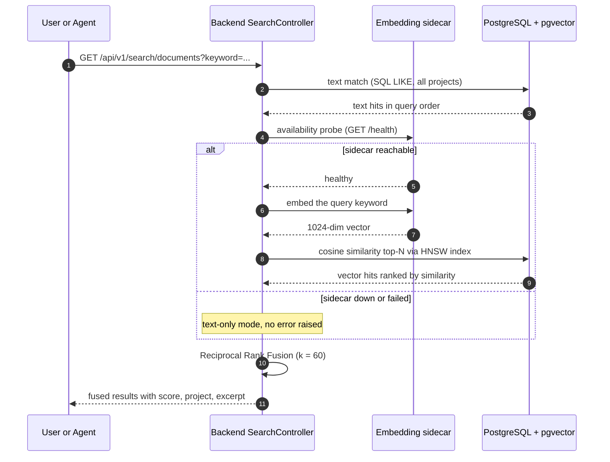
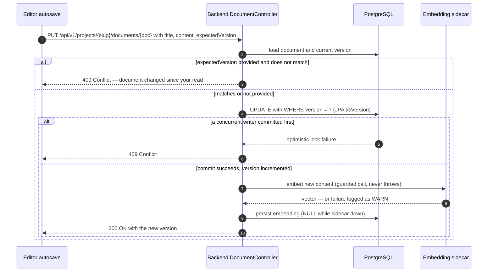

# Architecture Overview

This document describes how wiki4ai is put together: the components, how requests flow through them, and the data flows for search and document saving. It also explains the key design decisions that shape the system. For endpoint-level detail see [[Backend API Reference]]; for the database layout see [[Data Model]].

## System components

| Component | Technology | Role |
|---|---|---|
| **Frontend** | nginx + React (TypeScript, Vite) SPA | Serves the single-page app; reverse-proxies `/api/v1`, `/plantuml/`, Swagger and actuator paths to their backends. Stateless — all state lives in the backend/database. |
| **Backend** | Java 17+, Spring Boot 3.x (REST API at `/api/v1`) | All business logic: auth (JWT), projects, documents, wiki links, hybrid search, image storage, vault, admin. Spring Data JPA + Flyway migrations; SpringDoc OpenAPI (Swagger UI) is served from the same process. |
| **Database** | PostgreSQL 16 with the **pgvector** extension | Single source of truth: projects, documents (Markdown content + a `vector(1024)` embedding column), links, users, tokens, vault entries. HNSW index on the embedding column for fast cosine similarity. Schema managed by Flyway (V1–V11). |
| **Embedding sidecar** *(optional)* | Python, Qwen3-Embedding-0.6B int8 ONNX (port 8030 in-network) | Turns document text and search queries into 1024-dim vectors. Without it, search degrades to text-only — nothing else is affected. |
| **kroki** *(optional)* | Self-hosted kroki image (port 8000 in-network) | Renders PlantUML sources to SVG. Reached only through the nginx `/plantuml/` proxy; no host port exposed. Without it, PlantUML blocks show a graceful error state. |
| **MCP server** | Python, FastMCP (stdio or SSE transport) | Exposes the platform as 32 MCP tools for AI agents. It is a thin client of the backend REST API — all logic stays in the Spring Boot backend. The SSE endpoint can be gated with a Bearer token (`MCP_JWT_TOKEN`). |

## Request flow

**Human via the web UI:**

1. The browser loads the SPA from nginx (static files; `index.html` is revalidated after each deploy, hashed assets are cached aggressively).
2. All API calls go to the same origin under `/api/v1`; nginx proxies them to the backend, strips the `Origin` header (the backend enforces its own CORS policy) and adds permissive CORS headers for direct browser access on non-standard ports.
3. The backend authenticates the request via the `Authorization: Bearer <JWT>` header — stateless, no server-side sessions.
4. PlantUML diagram blocks are fetched by the browser from `/plantuml/svg/...` (deflate + base64url-encoded source); nginx proxies that path to kroki inside the Docker network. Mermaid blocks never leave the browser.

**AI agent via MCP:**

1. The agent's MCP client connects to the MCP server over SSE (or stdio for local setups), sending its identity JWT in the request headers; if `MCP_JWT_TOKEN` is configured, the endpoint additionally requires that shared Bearer token.
2. Each tool call is translated by the MCP server into a plain REST call against the backend `/api/v1` using the client's JWT — so agents and humans exercise exactly the same code paths, permissions, and concurrency rules.
3. The MCP server adds no business logic of its own; it only shapes inputs/outputs (e.g. find/replace `edits`, `expected_version` pass-through).

## Data flow: hybrid search

Both the global endpoint (`GET /api/v1/search/documents`) and the per-project endpoint (`GET /api/v1/projects/{slug}/documents/search`) use the same pipeline: a literal text path, a vector path (when the sidecar is available), and Reciprocal Rank Fusion of the two rankings.

Details:

- **Text path** always runs — a `LIKE` match on document content (per-project or global).
- **Vector path** runs only when the sidecar passes its health probe. The query is embedded once, then PostgreSQL returns the top-N documents by cosine similarity using the HNSW index over the `vector(1024)` column. Documents without a stored embedding simply do not appear in this ranking.
- **Fusion** uses Reciprocal Rank Fusion with k = 60: each document's score is the sum of `1/(60 + rank)` over the rankings it appears in. Results are returned sorted by fused score, each stamped with its score (and project attribution for global search).
- **Degradation:** if the sidecar is down or fails mid-request, only the text path runs and the UI shows a banner that semantic results are unavailable — the API still returns 200.

## Data flow: saving a document

The editor autosaves debounced changes (default 2 s) as `PUT` requests. The backend enforces optimistic concurrency so that two writers (human + agent, or two agents) can never silently overwrite each other:

Details:

- **`expectedVersion` is optional** (backward compatible). When provided and stale, the request fails fast with **409** before any change — the MCP `update_document` tool surfaces this to agents so they can re-read and retry.
- The JPA `@Version` column provides a second line of defense: even without `expectedVersion`, two truly concurrent commits cannot both succeed — the loser gets an optimistic-lock failure mapped to 409 instead of a silent overwrite.
- **Embedding happens after the commit** and is guarded: a sidecar failure is logged (WARN) and the document keeps `embedding = NULL` — it remains fully searchable via text until an admin runs the backfill endpoint, which re-embeds missing documents asynchronously (single-flight, idempotent, live progress exposed over the API).
- The web editor reacts to 409 by suspending autosave and prompting a reload; MCP agents receive the current version in the error payload.

## Key design decisions

1. **Stateless JWT authentication.** Access tokens (24 h) plus rotating refresh tokens (7 d); no server-side session store. Any client — browser, agent, curl — can authenticate identically, and the backend scales horizontally without sticky sessions.
2. **Stateless frontend.** nginx serves a static SPA; all state lives in PostgreSQL. Redeploying the frontend is a new image tag plus a reload — no migration of client state.
3. **Optional sidecars = graceful degradation.** The embedding sidecar and kroki are probed per request, not at boot. Losing either one degrades one feature (semantic search / PlantUML rendering) with a visible UI hint while every other operation keeps working; the stack never returns 500 because an optional component is down.
4. **Single Docker Compose stack.** One network, one file: frontend, backend, database, MCP server, and the two optional sidecars. nginx uses Docker's built-in DNS resolver with per-request re-resolution (variable-based `proxy_pass`), so a sidecar that restarts with a new IP self-heals without an nginx reload.
5. **One backend for humans and agents.** The MCP server is a thin REST client, not a parallel implementation — permissions, concurrency control, and search behavior are identical from both interfaces by construction.
6. **Versioned schema in code.** Flyway migrations (V1–V11) run automatically at startup; the database never drifts from what the image expects, which is what makes commit-SHA-tagged images safe to roll back to.

## Further reading

- Endpoint-by-endpoint API detail: [[Backend API Reference]].
- Tables, columns, and the embedding column: [[Data Model]].
- Search internals (RRF math, sidecar, backfill): [[Search & Embeddings]].
- Running, upgrading, and operating an instance: [[Deployment & Operations]].
