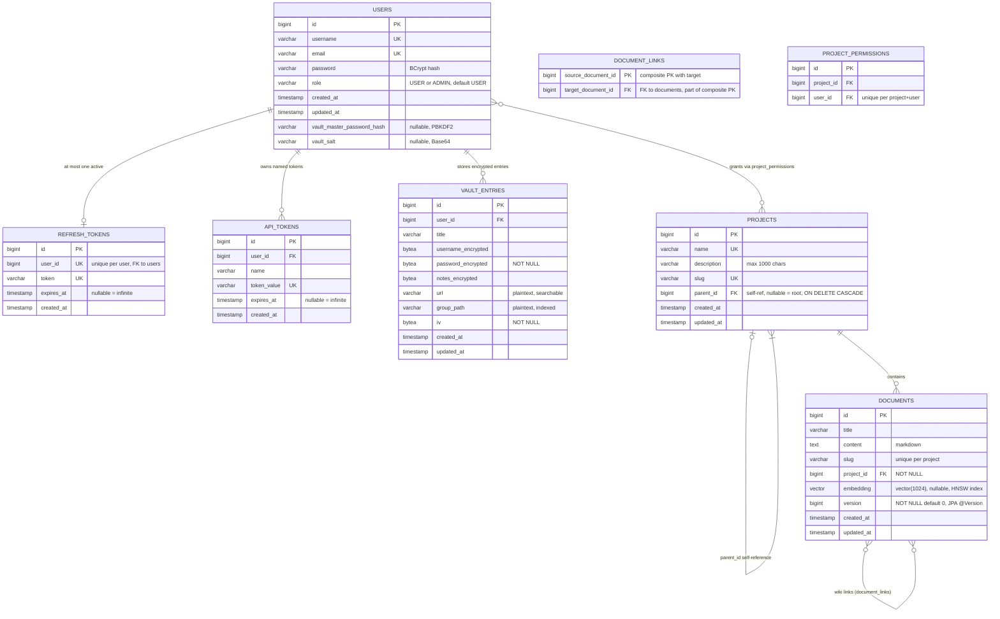

# Data Model

The wiki4ai database is a single **PostgreSQL 16** instance running the **pgvector** extension (compose image `pgvector/pgvector:pg16`). The schema is managed exclusively by **Flyway** migrations V1–V11 (`backend/src/main/resources/db/migration/`); in the postgres profile Hibernate runs with `ddl-auto: validate`, so the JPA entities and the migrations must always agree.

All tables use `BIGSERIAL` identity primary keys and `TIMESTAMP` (local, no timezone) audit columns set by JPA lifecycle callbacks (`@PrePersist`/`@PreUpdate`).

## Entity-relationship diagram

## Entity reference

### users

| Column | Type | Constraints / notes |
|---|---|---|
| id | BIGSERIAL | PK |
| username | VARCHAR(255) | NOT NULL, **UNIQUE** |
| email | VARCHAR(255) | NOT NULL, **UNIQUE** |
| password | VARCHAR(255) | NOT NULL — BCrypt hash (never plaintext) |
| role | VARCHAR(255) | NOT NULL, `CHECK (role IN ('USER','ADMIN'))`, default `'USER'` (V2 adds it on pre-existing DBs) |
| created_at / updated_at | TIMESTAMP | NOT NULL, set by JPA callbacks (`created_at` updatable=false) |
| vault_master_password_hash | VARCHAR(255) | nullable (V7) — PBKDF2WithHmacSHA256, 100k iterations, client-computed |
| vault_salt | VARCHAR(255) | nullable (V8) — Base64 PBKDF2 salt, synced server-side so all of a user's clients derive the same vault key |

JPA entity `User` additionally holds a `@OneToOne(mappedBy="user", orphanRemoval)` to `RefreshToken`.

### projects

| Column | Type | Constraints / notes |
|---|---|---|
| id | BIGSERIAL | PK |
| name | VARCHAR(255) | NOT NULL, **UNIQUE** (checked in the service → 409 on create; renaming is allowed and never touches the slug) |
| description | VARCHAR(1000) | nullable |
| slug | VARCHAR(255) | NOT NULL, **UNIQUE** — generated once from the name at creation; stable across renames (WIKI4AI-54) |
| parent_id | BIGINT | nullable FK → `projects(id)` **ON DELETE CASCADE** (V9) + index `idx_projects_parent`; null = root project. Depth ≤ 5 and cycle prevention are enforced in the service layer |
| created_at / updated_at | TIMESTAMP | NOT NULL |

Self-referencing hierarchy: a project has at most one parent; deleting a project cascades to its subprojects (DB-level) and documents (JPA `CascadeType.ALL, orphanRemoval`).

### documents

| Column | Type | Constraints / notes |
|---|---|---|
| id | BIGSERIAL | PK |
| title | VARCHAR(255) | NOT NULL — changing it regenerates the slug |
| content | TEXT | nullable — Markdown source |
| slug | VARCHAR(255) | NOT NULL, **UNIQUE within a project** (`UNIQUE (project_id, slug)`); generated from the title with diacritic transliteration ("Úvod do Wiki4AI" → `uvod-do-wiki4ai`) |
| project_id | BIGINT | NOT NULL FK → `projects(id)` |
| embedding | vector(1024) | nullable (V10) — pgvector column, **intentionally not mapped on the JPA entity**; all vector I/O goes through native queries (`updateEmbedding`, `findTopByEmbeddingSimilarity`). HNSW index below |
| version | BIGINT | NOT NULL DEFAULT 0 (V11) — JPA `@Version`; Hibernate appends `WHERE version = ?` to every UPDATE and increments on success; concurrent stale commits fail → HTTP 409. Existing rows were backfilled to 0 |
| created_at / updated_at | TIMESTAMP | NOT NULL |

### document_links (N:M self-reference)

Composite PK `(source_document_id, target_document_id)`, both BIGINT NOT NULL FK → `documents(id)`. Populated server-side from `[[WikiLink]]` syntax extracted out of the Markdown on every create/update. Links are project-scoped by construction (the API rejects cross-project and self links). This table powers outgoing link lists, backlinks, and the graph view.

### project_permissions (+ element collection)

| Column | Type | Constraints / notes |
|---|---|---|
| id | BIGSERIAL | PK |
| project_id | BIGINT | NOT NULL FK → `projects(id)` |
| user_id | BIGINT | NOT NULL FK → `users(id)`; **UNIQUE (project_id, user_id)** |

The permission set itself is a JPA element collection stored in `project_permission_values (permission_id FK, permission SMALLINT)` — one row per granted level. Levels: `READ`, `CREATE`, `UPDATE`, `DELETE`, `MANAGE` (MANAGE implies all others). The creator of a project is auto-granted MANAGE; the ADMIN role bypasses these checks entirely.

### refresh_tokens

| Column | Type | Constraints / notes |
|---|---|---|
| id | BIGSERIAL | PK |
| user_id | BIGINT | NOT NULL, **UNIQUE** FK → `users(id)` — one active refresh token per user; each login/token call replaces it (delete + insert, striped-locked) |
| token | VARCHAR(255) | NOT NULL, UNIQUE — the JWT itself (`type=REFRESH`) |
| expires_at | TIMESTAMP | nullable since V4 — **null = infinite lifetime** |
| created_at | TIMESTAMP | NOT NULL |

### api_tokens

| Column | Type | Constraints / notes |
|---|---|---|
| id | BIGSERIAL | PK |
| user_id | BIGINT | NOT NULL FK → `users(id)` — a user can have many named tokens |
| name | VARCHAR(255) | NOT NULL |
| token_value | VARCHAR(512) | NOT NULL, UNIQUE — the JWT access token (`type=ACCESS`) |
| expires_at | TIMESTAMP | nullable — null = never expires |
| created_at | TIMESTAMP | NOT NULL |

### vault_entries

| Column | Type | Constraints / notes |
|---|---|---|
| id | BIGSERIAL | PK |
| user_id | BIGINT | NOT NULL FK → `users(id)`; index `idx_vault_user_id` |
| title | VARCHAR(255) | NOT NULL — plaintext (search/display) |
| username_encrypted | BYTEA | nullable — AES ciphertext, Base64 in DTOs |
| password_encrypted | BYTEA | NOT NULL |
| notes_encrypted | BYTEA | nullable |
| url | VARCHAR(2048) | **plaintext** by design (used for search/display, not encrypted) |
| group_path | VARCHAR(512) | plaintext folder path; index `idx_vault_group_path` |
| iv | BYTEA | NOT NULL — encryption initialization vector |
| created_at / updated_at | TIMESTAMP | NOT NULL |

End-to-end encryption: fields are encrypted **client-side** with a key derived from the user's master password (PBKDF2WithHmacSHA256, 100k iterations, per-user salt). The backend stores and returns only ciphertext — it never sees plaintext values.

## Key design details

- **Optimistic locking (`documents.version`, V11).** New documents start at version 0; every successful update increments it. Clients may send `expectedVersion` on update for an explicit pre-check (409 with both versions before any change); the JPA `@Version` WHERE-clause is the backstop even when clients omit it. This is what makes concurrent WebUI autosave and MCP agent writes safe — stale writes 409 instead of overwriting.
- **Embeddings (`documents.embedding`, V10).** `vector(1024)` + HNSW index `idx_documents_embedding_hnsw` with cosine distance ops (`USING hnsw (embedding vector_cosine_ops)`). Deliberately *not* part of the JPA mapping: the entity stays plain and vector reads/writes are native SQL, so a database without pgvector still boots (H2 dev profile). See [[Search & Embeddings]] for the full pipeline.
- **Subproject hierarchy (`projects.parent_id`, V9).** Self-reference with `ON DELETE CASCADE`; depth ≤ 5 and anti-cycle checks live in `ProjectService` (walking up from the proposed parent, plus a BFS depth check over descendants when moving deeper). Root projects have `parent_id = NULL`.
- **Unique constraints summary.** `users.username`, `users.email`, `projects.name`, `projects.slug`, `documents (project_id, slug)`, `refresh_tokens.user_id`, `refresh_tokens.token`, `api_tokens.token_value`, `project_permissions (project_id, user_id)`, composite PK on `document_links`.
- **Link storage.** Wiki links are *derived data*: they are re-extracted from the Markdown content on every write and synced into `document_links` (added/removed as needed), so the table always mirrors the current content.
- **Audit columns.** `created_at` is immutable (`updatable = false`); `updated_at` refreshes on every JPA update — document lists are ordered by it.

## Flyway migrations (V1–V11)

Operator reference for what each migration does:

| Migration | What it does |
|---|---|
| **V1** `create_schema` | Creates the base schema: `users` (with role CHECK), `projects`, `documents` (+ `UNIQUE(project_id, slug)`), `document_links`, `project_permissions` + element-collection table. All `CREATE TABLE IF NOT EXISTS` (no-op on existing DBs). |
| **V2** `add_role_column` | Adds `users.role` (`USER`/`ADMIN`, default USER) if missing — upgrade path for pre-role databases; no-op otherwise. |
| **V3** `create_refresh_tokens_table` | Creates `refresh_tokens` (one per user, unique token) so refresh tokens survive deploys. |
| **V4** `make_expires_at_nullable` | Makes `refresh_tokens.expires_at` nullable — NULL now means an infinite-lifetime token. |
| **V5** `create_api_tokens_table` | Creates `api_tokens` for user-manageable named JWT access tokens (optional expiry, null = infinite). |
| **V6** `create_vault_entries_table` | Creates the encrypted vault: `vault_entries` with ciphertext BYTEA columns + IV, plaintext title/url/group_path, and indexes on `user_id` and `group_path`. |
| **V7** `add_vault_master_password_hash` | Adds `users.vault_master_password_hash` (PBKDF2 hash of the user's vault master password). |
| **V8** `add_vault_salt` | Adds `users.vault_salt` (Base64 PBKDF2 salt synced to all of a user's clients). |
| **V9** `add_project_parent_hierarchy` | Subprojects: adds `projects.parent_id` self-reference with `ON DELETE CASCADE` + index; existing projects stay roots. Depth/cycle rules are service-layer. |
| **V10** `add_document_embeddings` | Semantic search: `CREATE EXTENSION vector`, adds `documents.embedding vector(1024)`, creates HNSW index `idx_documents_embedding_hnsw` (cosine ops). Requires the pgvector image. |
| **V11** `add_document_version` | Optimistic locking: adds `documents.version BIGINT NOT NULL DEFAULT 0` (JPA `@Version`); existing rows backfilled to 0, first app update bumps them to 1. |
