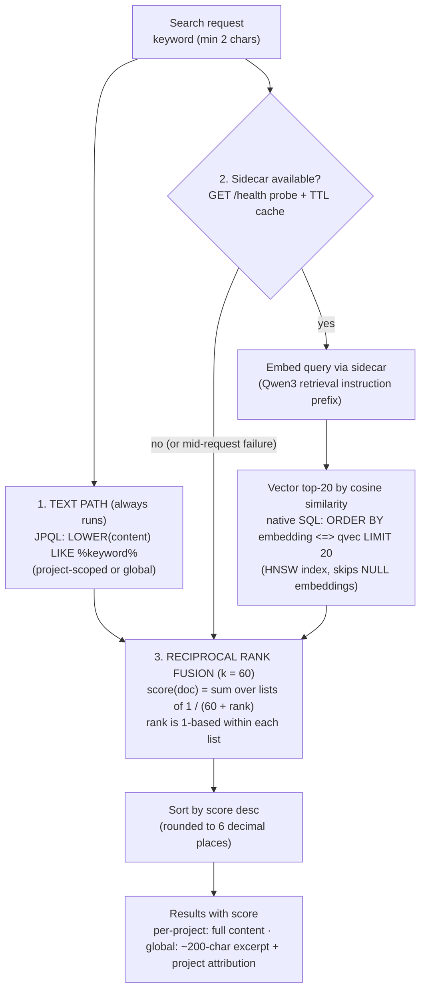

# Search & Embeddings

How wiki4ai's hybrid document search works end to end: the text path, the vector path (pgvector + HNSW), Reciprocal Rank Fusion, the local embedding sidecar, the admin backfill, and exactly what degrades when the sidecar is unavailable. Everything below is verified against `DocumentService`, `EmbeddingClient`, `EmbeddingService`, `DocumentRepository` and the sidecar source in `embedding/app.py`.

## Hybrid search internals

Both search endpoints — per-project (`GET /api/v1/projects/{slug}/documents/search`) and global (`GET /api/v1/search/documents`) — run the same three-stage pipeline (the global path simply drops the project filter; it reuses the same HNSW index):



**Text path.** A case-insensitive `LIKE '%keyword%'` over document content (JPQL in `DocumentRepository`). It always runs, regardless of sidecar state. Documents without an embedding are still found here.

**Vector path.** Only when the sidecar probe succeeds: the keyword is embedded as a *query* (the sidecar prepends the Qwen3 retrieval instruction), then a native query ranks documents by cosine distance using the pgvector operator `<=>` with `LIMIT 20` (`VECTOR_TOP_N`) — the HNSW index makes this an approximate nearest-neighbour scan. If the sidecar dies *between* probe and call, the exception is caught and the search continues text-only (never a 500).

**Reciprocal Rank Fusion.** The two ranked lists are fused with RRF using **k = 60** (`RRF_K`, the standard constant that dampens rank differences):

```
score(doc) = Σ_lists  1 / (60 + rank_list(doc))
```

- A document appearing in both lists gets both terms summed — this is how a literal match *and* a semantic match reinforce each other.
- Maximum possible score: ranked #1 in both lists → `2/61 ≈ 0.0328`; #1 in one list only → `1/61 ≈ 0.0164`. (Verified live: the top global-search hit on dev scored exactly `0.032787`.)
- Scores are rounded to 6 decimal places and attached to each result DTO; results are sorted by score descending.

**Why RRF instead of raw similarity?** The text path produces no meaningful numeric score (it's a boolean LIKE), so the system fuses *rankings* rather than scores — robust, tunable in one constant, and it keeps cross-lingual semantic hits working even when the keyword never appears literally.

## Embedding pipeline

### When documents get embedded

| Trigger | Behavior |
|---|---|
| Document **create** / **update** (full replace or contentEdits) | Synchronous `embedAndSave` after the JPA flush (so the stored text is final). One small document takes ~100–900 ms. **Guarded: never throws** — a sidecar failure is logged and the document stays searchable via text LIKE until a backfill fills the gap. Optimistic-locking exceptions are *re-thrown* (a conflict is not an embedding failure and must surface as 409). |
| Document **copy** | The copy is re-embedded like a create. |
| **Admin backfill** | Async, single-flight, idempotent — see below. |

The embedded text representation is `title + "\n" + content` (per the embeddings research decision), truncated at 512 tokens inside the sidecar. Vectors are rendered as pgvector literals with 6 decimal places (more precision than float32 needs, compact storage) and written via the native `updateEmbedding` query — the `embedding` column is deliberately absent from the JPA entity.

### The embedding sidecar

A separate container (service `embedding`, port **8030** in-network; compose builds it from `./embedding`) running FastAPI + ONNX Runtime on CPU:

| Property | Value |
|---|---|
| Model | **Qwen3-Embedding-0.6B, int8-quantized ONNX** (`model_int8.onnx`, ~614 MB) from `onnx-community/Qwen3-Embedding-0.6B-ONNX` on Hugging Face — downloaded at image build time |
| Output dimension | **1024** (L2-normalized, so cosine similarity = dot product) |
| Pooling | last-real-token pooling (correct under causal attention with right padding) |
| Truncation | 512 tokens (`EMBED_MAX_TOKENS`) |
| Batch cap | 4 texts per request (`EMBED_MAX_BATCH` — RAM budget); larger requests are chunked server-side, and the backend client batches in 4s too |
| Threads / memory | `OMP_NUM_THREADS=2`, ORT `enable_cpu_mem_arena=false`, container `mem_limit: 2560m` |
| Endpoints | `GET /health` → `{"status":"ok","model":"Qwen3-Embedding-0.6B-int8","dim":1024}` · `POST /embed` `{"texts":[...], "type":"document"|"query"}` → `{"vectors":[[...]], "dim":1024, "model":..., "truncated":bool}` |
| Query instruction | For `type=query` the sidecar prepends the official model-card prefix: `"Instruct: Given a web search query, retrieve relevant passages that answer the query\nQuery:"` — documents are embedded as-is. This asymmetry is what makes asymmetric (query↔document) retrieval work well. |
| Cold start | First boot loads ~614 MB into an ORT session (minutes on CPU) — compose healthcheck uses `start_period: 900s` for this reason |

## Backfill (admin)

- **Start:** `POST /api/v1/admin/embeddings/backfill?force=false` (ADMIN) → **202** immediately; the work runs on a single daemon thread (`embedding-backfill`). A second start while one is running → **409**.
- **Semantics:** walks *all* documents in batches of 4. `skipped` = documents that already have an embedding (unless `force=true`, which re-embeds everything — use after model changes). Per-batch failures increment `failed`, record `lastError`, and the run continues. On completion `processed == total`.
- **Progress:** `GET /api/v1/admin/embeddings/backfill/status` → `{running, force, total, processed, embedded, skipped, failed, lastError, startedAt, finishedAt}` (a `BackfillStatus` snapshot; idle state is all zeros with `running=false`).

## Graceful degradation

The sidecar is **optional** — the wiki must work without it. Failure handling at each layer:

| Layer | When the sidecar is down / slow |
|---|---|
| Probe (`EmbeddingClient.isAvailable`) | `GET /health` with a 2 s connect timeout. Any failure marks the sidecar unavailable for a **TTL window (default 15 s, `embedding.unavailable-ttl-ms`)** so a dead sidecar doesn't add latency to every request; probes inside the TTL return false without any HTTP call. |
| Search | Vector path skipped → results come from the text LIKE path only, still ranked and scored (RRF over a single list). **No 500s.** Documents that were never embedded are simply absent from the vector ranking. |
| Save paths | `embedAndSave` swallows the failure (logged); CRUD succeeds normally; the document is text-searchable until a backfill embeds it. |
| WebUI UX | The frontend polls `GET /api/v1/embeddings/status` → `{available, model: "Qwen3-Embedding-0.6B", dim: 1024}` and shows a visible **"semantic search unavailable" banner** instead of silently returning text-only results. |

**Score impact:** with the sidecar up, hits matching both literally and semantically reach ~0.0328; text-only mode caps a single-list rank-1 hit at ~0.0164. Relative ordering within text-only mode still follows RRF over the text ranking, but purely semantic matches (keyword absent from the content) disappear entirely — that is the only functional loss.

## Vector storage details

- **Dimensionality: 1024** — fixed by the model; the column type `vector(1024)` enforces it at the database level.
- **Extension:** `CREATE EXTENSION IF NOT EXISTS vector` (migration V10) — requires the `pgvector/pgvector:pg16` image (drop-in replacement for plain postgres:16).
- **Index:** `idx_documents_embedding_hnsw ON documents USING hnsw (embedding vector_cosine_ops)` — HNSW approximate nearest neighbours with cosine distance operators. "Overkill for a few hundred vectors, but trivially cheap and ready for corpus growth" (migration comment). The same index serves both per-project and global vector queries (the project filter is just a WHERE clause).
- **Distance operator:** `<=>` (cosine distance); the repository computes `similarity = 1 - distance` and orders by distance ascending. Rows with `embedding IS NULL` are excluded from vector results.

## Configuration

Backend properties (`application.yml`, prefix `embedding.*`) — env var names only, no secrets:

| Property | Env override | Default | Purpose |
|---|---|---|---|
| `embedding.base-url` | `EMBEDDING_BASE_URL` | `http://localhost:8030` (compose sets `http://embedding:8030`) | Sidecar base URL |
| `embedding.enabled` | — | `true` | Master switch; `false` disables semantic search entirely |
| `embedding.connect-timeout-ms` | — | `2000` | Low on purpose so a dead sidecar never stalls requests |
| `embedding.read-timeout-ms` | — | `120000` | CPU embedding of a 4-text batch can be slow |
| `embedding.batch-size` | — | `4` | Must stay ≤ the sidecar's `EMBED_MAX_BATCH` |
| `embedding.unavailable-ttl-ms` | — | `15000` | How long to remember the sidecar as unavailable after a failed probe |

Sidecar env vars (container): `MODEL_DIR` (default `/models`), `EMBED_MAX_TOKENS` (512), `EMBED_MAX_BATCH` (4), `OMP_NUM_THREADS` (2). Related instance config: `JWT_SECRET`, `AUTH_REGISTRATION_OPEN`, `ADMIN_INITIAL_USERNAME`/`ADMIN_INITIAL_PASSWORD`, `UPLOAD_DIR` — see [[Backend API Reference]] for the auth-side properties.
