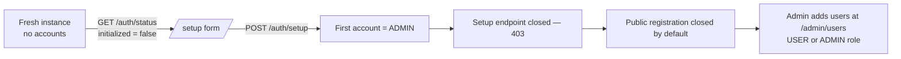

# WebUI Guide

This guide walks through the wiki4ai WebUI (React SPA) screen by screen: login and first-run setup, navigation, project management with subproject hierarchy, the document editor with autosave and version-conflict handling, diagram rendering (Mermaid + PlantUML), image uploads, hybrid search, wiki links, interface language, and admin user management. All screenshots below were captured live on the dev instance (image `cbd10466`, schema V12) unless noted otherwise; UI labels are quoted exactly as rendered. The interface language shown is **English** — the default since WIKI4AI-73; see [Interface Language](#interface-language).

## Login & first-run setup

The login page (`/login`) shows a single card — "Login to Wiki4AI" — with **Username** and **Password** fields and a **Login** button. On an initialized instance with registration closed (the default), there is no register link in the footer.


On a **fresh instance** (no accounts yet, `GET /api/v1/auth/status` → `initialized: false`) the login route redirects to `/setup`, which shows the "First-time setup" form: *This instance has no accounts yet. The account you create now will become the administrator.* Fields: **Username** (min 2 chars), **Password** (min 8 chars), **Confirm password**; button **Create admin account**. Submitting calls `POST /api/v1/auth/setup`, creates the first account with the **ADMIN** role, and sends you back to `/login`. Afterwards the setup endpoint returns `403` and the form disappears — there is no way to reach it again on an initialized instance.


## Navigation & layout

There is no sidebar — the whole app hangs off a **sticky glassmorphism top bar**:

- **Hexagon logo** (left) → dashboard (`/`).
- **Global search input** (placeholder `Search the wiki...`) — visible only to authenticated users; submitting navigates to `/search?q=...` (minimum 2 characters). See [Search](#search-global--per-project).
- **Auth section** (right): **Vault** button (purple, opens the password vault at `/vault`), **Admin** button (amber, rendered only for `role: ADMIN`, opens `/admin/users`), a link with your **username** (opens `/profile`), and a red **Logout** button.

Inside the app, every page starts with a **breadcrumb** trail (`Dashboard → project → document`, extended with ancestor projects when you are inside a subproject).

## Projects

The dashboard (`/`) is the project list: hero "Wiki4AI Projects" / *Manage and organize your AI documentation projects*, a stats row (**N Projects | M Documents**), a **+ New Project** button, and a client-side filter box (`Search projects...`, 300 ms debounce). Each project card shows the name, an **N docs** badge, the description (truncated at 120 characters), `@slug` and the creation date, plus **✏️ Edit** and **🗑️ Delete** buttons.

### Create

Clicking **+ New Project** opens an inline "Create New Project" form: **Project name** (required) and **Description (optional)** with **Create** / **Cancel**. The slug is generated from the name (lowercase, hyphenated).

### Subprojects (hierarchy)

Projects can be nested up to 5 levels deep. On the dashboard, a parent card renders its subprojects as indented rows with a **↳** marker and their own docs badge; branches that have children get a collapse/expand toggle (**▸ / ▾**). Each row links straight to the subproject. The screenshot below shows a temporary parent ("A13 Hierarchy Demo") with one child ("A13 Demo Child") — both were deleted after capture.


Subprojects are created from the project detail page: the **Subprojects (N)** section has a **+ New Subproject** button that expands an inline form (**Subproject name** placeholder / **Create Subproject** button). The same section also appears on the dashboard cards.

### Rename & settings

The card's **✏️ Edit** button opens an "Edit Project" modal (name + description) — renaming does **not** change the slug, so links keep working. The full **Project settings** page (`/projects/:slug/settings`) offers the same fields plus a **Parent project** selector (move the project to another parent or back to root), and a **Danger Zone** with project deletion.

### Delete

The card's **🗑️ Delete** button opens a "Delete Project" confirmation dialog: *Are you sure you want to delete project "X"? All documents and subprojects will be permanently removed.* Deleting a parent cascades to all its subprojects (verified live during this guide's screenshot session).

### Project detail page

`/projects/:slug` lists the project's documents: header with name/description, action buttons (**+ New Document**, **📁 Import file** — drag & drop `.md` / `.markdown`, **📦 Export** — downloads the project as a ZIP, **⚙️ Settings**), the subproject section, and two tabs: **Documents (N)** and **Graph**. The document list shows title, `@slug`, update date/time and a per-row delete button; while searching, each row also shows its relevance score. The **Graph** tab links to the force-directed **document graph** visualization at `/projects/:slug/graph`.

## Document editor

The editor (`/projects/:slug/documents/:docId/edit`) is a split-view workspace: Monaco-based markdown editor on the left, live rendered preview on the right (switchable via the **Edit / Preview / Split** pill buttons; default is Split). The header holds the title input, autosave controls, a **Save** button and a **← Back** back button. A footer shows live word and character counts.


### Toolbar

Ten pill buttons insert markdown at the cursor: **Bold** (Ctrl+B), **Italic** (Ctrl+I), **Heading** dropdown (H1–H6), **Code block**, **Inline code**, **Quote**, **Link** (modal "Insert Link": URL + link text), **Image** (modal "Insert Image": URL + alt text), **Divider**, and **Table 3×3**.

### Autosave

Autosave is on by default with a **2 second debounce** (`AUTO_SAVE_DELAY_DEFAULT = 2000` ms in `DocumentEditor.tsx`). The toggle and the interval dropdown (**1s / 2s / 5s / 10s / 30s**) persist per browser in `localStorage`. While typing, the compact status badge next to the controls walks through **Unsaved changes** → **Saving...** → **Saved**, then fades back to idle after 2 seconds. This behavior was verified live: a single-character edit produced exactly one debounced PUT ~2 s later. No-op saves are skipped — a PUT with unchanged content is never sent, which also prevents spurious version bumps for other sessions.

### Version conflict banner (optimistic locking)

Since WIKI4AI-72 every document carries a `version` counter; the editor sends it on save and the backend rejects stale writes with **409**. When that happens the editor shows a red alert banner:

> Document has been modified by another session. Please reload and reapply your changes. — **[Reload]**

The **Reload** button re-fetches the current content; autosave is suspended while the conflict is active, so the editor never auto-retries over someone else's change. A real 409 was captured end-to-end during WIKI4AI-72 verification (see [[Backend API Reference]] for the raw request/response example).

### Document links panel

When editing an existing document, a **🔗 Document Links** panel appears at the bottom with two lists — **Outgoing links** and **Backlinks** — where explicit document-to-document links can be added by numeric ID. This is separate from `[[WikiLink]]` syntax; see [Wiki links](#wiki-links).

## Diagrams

### Mermaid (client-side)

```mermaid blocks are rendered in the browser with the `mermaid` npm library (v11), dark theme, no server round-trip. Any diagram type shipped with mermaid v11 works — flowchart, sequence, class, state, ER, gantt, pie, journey, gitgraph, mindmap, timeline, quadrant, sankey, xy chart, C4 and more. While rendering you see a "Loading diagram…" spinner; invalid syntax shows a **Diagram Error:** block with the parser message instead of crashing the page.


### PlantUML (via kroki sidecar)

```plantuml blocks are rendered through the self-hosted **kroki** service: the browser deflates + base64url-encodes the source and fetches `/plantuml/svg/<encoded>` (nginx proxies to the kroki container on the Docker network — no host port needed). Rendering is therefore optional: when kroki is down or the syntax is invalid, the block degrades gracefully to a red **"PlantUML diagram not rendered:"** error card showing the HTTP status, a hint (*The self-hosted kroki service may be unavailable, or the diagram source has a syntax error*), and the raw PlantUML source in a code block — the rest of the document renders normally.


## Images

Uploaded images are stored per project and served **only to authenticated users** (login-only policy, same as global search). The upload endpoint is:

```
POST /api/v1/images/{projectSlug}     (multipart/form-data, field "file", Bearer JWT)
```

Accepted formats: PNG, JPEG, WebP, GIF, SVG; max **10 MB**; the MIME type is detected from magic bytes. The response returns a stable relative URL and a ready-to-paste markdown snippet:

```json
{
  "url": "/images/{projectSlug}/{uuid}.{ext}",
  "markdown": ""
}
```

Embedding into a document is just pasting that snippet (or using the toolbar **Image** button with the `/images/...` URL). Because a plain `` cannot carry a Bearer token, the WebUI intercepts any `/images/...` source and fetches it through the authenticated API client (`GET /api/v1/images/{projectSlug}/{filename}`, `Cache-Control: no-store`, CSP header for SVG), displaying it via a blob URL. External `http(s)` image URLs in markdown pass through unchanged — only uploaded paths go through the auth proxy.

## Search (global & per-project)

### Global search

The top-bar search box lands on `/search` — "Global Search" (*Hybrid (text + semantic) search across all Wiki4AI projects.*). Queries need at least 2 characters and are debounced (300 ms). Results are **hybrid**: literal text match fused with pgvector semantic similarity via Reciprocal Rank Fusion, ranked across **all** projects. Each hit shows the title, its RRF score (4 decimals), a **project badge**, an excerpt, `@slug` and update date/time; clicking opens the document.


### Semantic status banner

Both search surfaces show the embedding sidecar's state:

- **Available** — a green badge: `semantic search: active`.
- **Unavailable** (embedding sidecar down) — an amber banner: `Semantic search is unavailable — showing text-only results.` and results silently degrade to text-only matching. No error is thrown anywhere else in the app.

### Per-project search

The project detail page has its own search bar (same debounce, same hybrid backend, scoped to one project) with the identical semantic badge — useful when you want to stay inside a single project while filtering documents.

## Wiki links

`[[WikiLink]]` syntax is wiki4ai's internal cross-reference mechanism. The important behavior (verified against the live UI): **inline `[[...]]` in markdown renders as literal text in the viewer** — it is *not* converted into an anchor. Navigation happens through the panels at the bottom of every document page:

1. **🔗 Links (N)** — the wiki-links panel. The viewer extracts all `[[Target]]` occurrences from the raw markdown client-side and lists them as buttons; clicking one navigates to `/projects/{same project}/documents/{slugified target}` (same-project navigation only).
2. **📎 Linked from (N)** — backlinks panel, always visible: documents whose content references this page, or *No documents link to this page*.
3. **Graph view** (`/projects/:slug/graph`) — the same link topology as a force-directed graph.


## Interface Language

Since WIKI4AI-73 the WebUI is internationalized (react-i18next, 413 translation keys per locale) and ships two languages: **English** — the default and fallback — and **Slovak**. The active language follows the authenticated user's saved preference (`users.language`, persisted via `PUT /api/v1/auth/me`), so a change applies immediately, survives reloads, and follows the account across devices. Anonymous pages (login, setup, register) and the post-logout state always render in English.

The switch lives on the **Profile** page (`/profile`) in the **Language** card: an **Interface Language** dropdown with **English** / **Slovenčina**. The card's text reads *Choose your preferred interface language. Changes apply immediately and are saved to your account.*; a failed save shows a "Failed to save language preference" toast.


The same dashboard rendered in Slovak, for reference (switched via Profile → Language):


## User management (Admin)

`/admin/users` is visible only to admins (the **Admin** top-bar button; non-admins get a 403 screen — *403 - Access Denied / You need ADMIN role to access this page.*). The page has two sections:

- **Create New User** — Username (2–50 chars), Email, Password (min 8 chars), Role select (**USER** default / **ADMIN**), **Create User** button. Success shows a toast and refreshes the list.
- **All Users (N)** — table with ID, Username, Email, **Role** (an inline dropdown — changing it updates the role immediately, with a confirmation toast), Created date, and Actions: **🗑️** delete, or **🔒** for your own row (self-deletion is blocked — *Cannot delete your own account*). Deleting another user opens a "Confirm Delete" dialog (*Are you sure you want to delete user X? This action cannot be undone.*).


## Account lifecycle recap

The account model is deliberately closed:



1. **First run** — an empty instance has no credentials anywhere; the visitor is sent to `/setup` and the account created there becomes the administrator (WIKI4AI-69).
2. **Registration closed by default** — after the first account exists, `POST /api/v1/auth/register` is disabled and the login page shows no register link (WIKI4AI-70).
3. **Admin-managed users** — all subsequent accounts are created by an admin in the WebUI (`/admin/users`) or via the REST API, with an explicit `USER` or `ADMIN` role; admins can change roles and delete users (but never themselves).

For the full auth endpoint reference see [[Backend API Reference]]; for how search embeddings interact with the account model see [[Search & Embeddings]].
