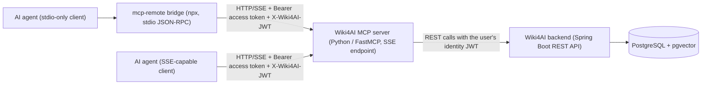
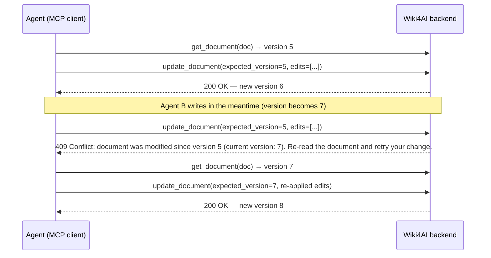

# MCP Server

The Wiki4AI MCP server is a [Model Context Protocol](https://modelcontextprotocol.io) endpoint that exposes the entire Wiki4AI platform to AI agents. It runs as a standalone Python service (FastMCP), translates every tool call into ordinary REST calls against the backend API **as an authenticated user**, and returns structured results — so an agent can create projects, write documents, search semantically, manage wiki links, upload images and work with the per-user vault using nothing but MCP tool calls.

## What is the MCP server

- **Purpose:** let any MCP-capable AI agent (DeepSeek Harness, Claude Desktop, OpenCode, custom agents) read from and write to a Wiki4AI instance without speaking HTTP/JSON directly.
- **Implementation:** single-file Python service (`mcp_server.py`, FastMCP ≥ 2.12 on Python 3.12), no external HTTP dependencies beyond the standard library — it calls the backend REST API with `urllib`.
- **Tool surface:** 32 tools covering projects, documents, search, wiki links, images and the vault (full reference below). The server also exposes two MCP *resources* for clients that support them:
  - `wiki://{project_slug}/{doc_slug}` — raw Markdown content of a document
  - `wiki://{project_slug}/{doc_slug}/html` — rendered HTML version
- **Identity model:** the server holds no user account of its own. Every backend call is made with *your* Wiki4AI JWT (see [Security model](#security-model)), so agents inherit exactly the permissions of the user they act as.

### Transports

| Transport | How | When to use |
|---|---|---|
| **SSE** (server-side default for deployments) | `python mcp_server.py --transport sse --port 8095` — HTTP Server-Sent Events endpoint, typically exposed as `:8099/sse` through the stack's port mapping or reverse proxy | Remote agents / other hosts; clients that speak SSE natively |
| **stdio** (client-side default) | `python mcp_server.py` — JSON-RPC over stdin/stdout | Local agents on the same machine as the backend |
| **stdio ↔ SSE bridge** | `npx -y mcp-remote <sse-url> --header ... --allow-http` — an stdio client spawns `mcp-remote`, which connects to the SSE endpoint (it tries streamable HTTP first, then falls back to SSE) | **Any MCP client without a native SSE transport** (e.g. DeepSeek Harness's MCP client) must bridge this way |

The reference Docker image (`python:3.12-slim` + `fastmcp`) starts with `--transport=sse --port=8095`, exposes container port 8095 and health-checks `http://localhost:8095/health`; the deploy compose file maps it as a service (`mcp-server`) with environment variables `MCP_BASE_URL` (backend API base) and `MCP_JWT_TOKEN` (endpoint access credential — see below).

## Architecture

The MCP server is a thin, stateless adapter: it never touches the database directly. It forwards each tool call to the backend REST API using the identity JWT provided by the client (or configured server-side), and the backend enforces all authentication, authorization and optimistic locking as usual.



Request flow for one tool call:

1. The agent client sends a `tools/call` over stdio or SSE (after the MCP `initialize` handshake, which reports `serverInfo.name = "wiki4ai"`; the reported version is the FastMCP library version of the running service).
2. On a **gated** instance the HTTP layer first verifies the endpoint access credential (`Authorization: Bearer <token>` against `MCP_JWT_TOKEN`).
3. The server extracts the *identity* JWT for this request (header priority below) and stores it in a per-request context variable.
4. The tool handler translates the arguments into one or more REST calls to `MCP_BASE_URL` with that identity JWT in the `Authorization` header.
5. The backend responds exactly as it would for a WebUI user — including 401/403 permission errors and 409 optimistic-locking conflicts, which the MCP layer rewrites into actionable tool errors.

## Security model

The server deliberately separates **two independent credentials** (source: `mcp_server.py`, middleware + `select_jwt_token()`):

### 1. Access credential — "who may reach this MCP endpoint"

- Configured via the environment variable **`MCP_JWT_TOKEN`**.
- **Gated instance (value set):** every HTTP request to the SSE endpoint must carry `Authorization: Bearer <token>` matching it (constant-time comparison). Missing or wrong tokens are rejected with HTTP 401 and body `{"error": "Unauthorized: missing or invalid Bearer token"}` — before any MCP handshake happens.
- **Open instance (empty/unset):** the endpoint is open — anyone who can reach the network port can connect (legacy behavior). Use only on trusted networks.

### 2. Identity — "which Wiki4AI user does the agent act as"

A Wiki4AI user JWT, selected per request by `select_jwt_token()` in this priority order:

| Priority | Source | Notes |
|---|---|---|
| 1 | `X-Wiki4AI-JWT` request header | Dedicated identity channel. **Preferred on gated instances**, where the `Authorization` header must carry the access credential instead. |
| 2 | `Authorization: Bearer <jwt>` | Used when it is a real user JWT (open instances, where the auth header doubles as identity). |
| 3 | `?token=<jwt>` query parameter | Last resort for clients that cannot set headers. |

- **The access credential is never used as identity.** A value equal to `MCP_JWT_TOKEN` is explicitly skipped by `is_access_credential()`: it is not an app-signed JWT, and the backend rejects any Bearer value that fails JWT verification with 401 — even on public endpoints.
- **stdio mode:** a server-side identity can be fixed with `--token <jwt>` (or `MCP_JWT_TOKEN`-independent environment configuration); in SSE mode client-provided headers always take priority, which lets one server serve many agents with different identities.

### What this means for self-hosters

- **Recommendation: run a gated instance** (`MCP_JWT_TOKEN` set) and give every agent its own Wiki4AI user account + JWT — least privilege per agent, and the access token can be rotated independently of user accounts.
- The **permission model is identical to the WebUI**: USER/ADMIN roles are enforced by the backend on every REST call, so an MCP agent can never do more than the corresponding WebUI user (e.g. a USER-role agent cannot delete other users' projects; ADMIN-only endpoints stay out of reach).
- Without any identity JWT, only public read operations work (project/document reads); authenticated tools such as `upload_image` fail with a clear 401 "Not authenticated" error explaining how to supply the JWT.

## Tool reference

**32 tools** (verified live via `tools/list` against the dev instance, serverInfo `wiki4ai` / FastMCP 4.0.5). Grouped by domain:

### Meta (3)

| Tool | Description | Key parameters |
|---|---|---|
| `health_check` | Health status of the backend service (application name, version, status) | — |
| `get_mermaid_guide` | Complete Mermaid syntax guide for AI agents: 5 diagram types with working examples and common error fixes | — |
| `get_plantuml_guide` | PlantUML guide for UML diagram types Mermaid does not cover (use case, component, deployment); rendered in the WebUI via the self-hosted kroki service | — |

### Projects (5)

| Tool | Description | Key parameters |
|---|---|---|
| `list_projects` | All projects accessible to the current user: id, name, slug, description, parentSlug, depth, documentCount | — |
| `get_project` | Details of one project by its URL-friendly slug | `slug` |
| `create_project` | Create a new project; optionally nest it under an existing project as a **subproject** | `name` (required), `description`, `parent_id` |
| `update_project` | Partial update of name, description and hierarchy position with tri-state move semantics | `slug` (required), `name`, `description`, `parent_id`, `move_to_root` |
| `delete_project` | Permanently delete a project **and all its documents** (irreversible) | `slug` (required) |

### Documents (10)

| Tool | Description | Key parameters |
|---|---|---|
| `list_documents` | Paginated document metadata for a project (no content) — call first to discover slugs and ids | `project_slug`, `page`, `size` (max 100) |
| `create_document` | Create a document; slug auto-generated from the title; Markdown with Mermaid/PlantUML code blocks supported | `project_slug`, `title`, `content`? |
| `batch_create_documents` | Create multiple documents in a single call | `project_slug`, `documents[]` (each `{title, content?}`) |
| `get_document` | Full raw Markdown content plus metadata — **including the current document version** | `project_slug`, `doc_slug` |
| `update_document` | Partial or full update: `edits` (find/replace) for safe concurrent editing, optional optimistic locking via `expected_version` | `project_slug`, `doc_slug`, `title`?, `content`? (full replace), `edits[]`?, `expected_version`? |
| `delete_document` | Permanently delete a document; wiki links pointing to it become broken | `project_slug`, `doc_slug` |
| `get_document_content` | Rendered HTML version with `[[WikiLink]]` references resolved | `project_slug`, `doc_slug` |
| `import_document` | Create a document from a raw Markdown string (both title and content required) | `project_slug`, `title`, `content` |
| `move_document` | Move a document to another project (removed from the source project) | `project_slug`, `doc_slug`, `target_project_slug` |
| `copy_document` | Duplicate a document into another project, or as a sibling within the same one; original preserved | `project_slug`, `doc_slug`, `target_project_slug`? |

### Search (2)

| Tool | Description | Key parameters |
|---|---|---|
| `search_documents` | Hybrid search in **one project**: literal text match fused with semantic pgvector cosine similarity (Reciprocal Rank Fusion); degrades gracefully to text-only when the embedding sidecar is down | `project_slug`, `keyword` (min 2 chars) |
| `search_documents_global` | The same hybrid matching **across all projects** (cross-project search); requires a valid identity JWT | `keyword`, `limit` (default 20, max 50) |

### Links (4)

| Tool | Description | Key parameters |
|---|---|---|
| `add_link` | Add a wiki link from one document to another within the same project | `project_slug`, `doc_slug` (source), `target_document_id` (**integer id**, not slug — get it from `list_documents`) |
| `remove_link` | Remove a wiki link between two documents | `project_slug`, `doc_slug`, `target_document_id` |
| `get_links` | Outgoing links: the documents this document links to | `project_slug`, `doc_slug` |
| `get_backlinks` | Incoming links: the documents that link to this one (use before deleting/restructuring) | `project_slug`, `doc_slug` |

### Images (1)

| Tool | Description | Key parameters |
|---|---|---|
| `upload_image` | Upload a base64 image (PNG/JPEG/WebP/GIF/SVG, max 10 MB) under an unguessable UUID name; returns the URL plus a ready-to-paste Markdown snippet ``. Uploaded images are login-only — never anonymously accessible | `project_slug`, `filename`, `image_base64` |

### Vault (7)

| Tool | Description | Key parameters |
|---|---|---|
| `vault_status` | Whether the current user has a vault master password set up (call before the first vault operation) | — |
| `vault_list_entries` | All entries, **metadata only** (title, url, groupPath, timestamps) — no credentials returned | — |
| `vault_search_entries` | Search entries by title/URL substring (metadata only) | `query`, `group_path`? |
| `vault_get_entry` | One entry with decrypted username/password/notes; decryption happens locally in the MCP process, the backend never sees plaintext | `entry_id`, `master_password` |
| `vault_create_entry` | Add a new entry — encrypted client-side before anything is sent | `title`, `password`, `master_password`, `username`?, `notes`?, `url`?, `group_path`? |
| `vault_update_entry` | Edit an entry; only the provided fields change (fetch → decrypt → merge → re-encrypt → submit) | `entry_id`, `master_password`, plus any of `title`/`username`/`password`/`notes`/`url`/`group_path` |
| `vault_delete_entry` | Permanently delete an entry (no master password required — deletion needs no decryption) | `entry_id` |

### Subprojects and project hierarchy

- **`create_project` with `parent_id`** creates a subproject nested under the given project. The hierarchy is limited to **5 levels deep**, and parents that would create a cycle are rejected by the backend with a clear error.
- **`update_project` tri-state move semantics** — exactly one of three outcomes per call:
  - *neither* `parent_id` *nor* `move_to_root` given → the hierarchy is **not changed** (no move);
  - `parent_id=<int>` → the project is moved under the project with that ID;
  - `move_to_root=true` → the project is moved back to root level.
  - Passing both is contradictory and raises an error. Moves are limited to 5 levels deep; cycles are rejected.
  - Note: the backend requires a non-blank name in every update payload. When you omit `name`, the tool fetches the project first and re-sends its current name unchanged, so description-only and hierarchy-only updates work as documented.

### Vault encryption (client-side)

- Entries are encrypted **before they leave the client**: AES-256-GCM with a key derived via PBKDF2-HMAC-SHA256 from `SHA-256(master password)` + the per-user salt (fetched from the backend), 100,000 iterations, 32-byte key. The encrypted fields are `username`, `password` and `notes` (JSON-encoded, then encrypted); `title`, `url` and `groupPath` stay plaintext for search and display.
- **The raw master password never leaves the client.** Only its SHA-256 hash is sent to the backend for verification (`GET /v1/vault/master-password/salt` → `POST /v1/vault/master-password/verify`).
- There is **one vault per user, shared between the WebUI vault page and these MCP tools** — an entry created via MCP is immediately visible and decryptable in the WebUI with the same master password, and vice versa.

## Multi-agent safety: optimistic locking (WIKI4AI-72)

Every document carries a monotonically increasing `version`. The safe write pattern for concurrent agents:

1. **Read** — `get_document` returns the content *and* the current version.
2. **Write with lock** — call `update_document` passing `expected_version` = the version you read, together with your change (`content` or `edits`).
3. **On success** — the response includes the new `version`; keep it for your next update.
4. **On conflict (HTTP 409)** — another writer got there first. The MCP layer rewrites the raw 409 into an actionable error, by design:

   > Conflict: document was modified since version X (current version: Y). Re-read the document and retry your change.

   (Variants exist when the backend reports only one of the two versions.) The message tells you exactly which versions are involved so the agent can recover without guessing.
5. **Recover** — re-read the document, re-apply your change on the fresh content, and update with the new `expected_version`.



### Best practices for multi-agent workloads

- **One writer per document at a time** is the simplest safe design; use `expected_version` when writers genuinely overlap.
- Prefer **`edits` (find/replace) over full-content replacement** when several agents append to a shared document — find strings must be unique (include the section heading), and a failed match fails the whole update atomically instead of clobbering someone else's section.
- **Always keep the `version` returned by each successful update** and pass it as the next `expected_version`; never reuse a stale one.
- Treat conflict messages as normal control flow: they are structured to be machine-actionable (stale version + current version), so a retry loop of *re-read → re-apply → retry* terminates cleanly.

## Setup for AI agents

### Generic stdio client configuration

For any MCP client that speaks stdio (JSON config with the common `mcpServers` shape — placeholder values, no real tokens):

```json
{
  "mcpServers": {
    "wiki4ai": {
      "command": "npx",
      "args": [
        "-y",
        "mcp-remote",
        "http://<YOUR_WIKI4AI_HOST>:8099/sse",
        "--header",
        "Authorization: Bearer <YOUR_MCP_ACCESS_TOKEN>",
        "--header",
        "X-Wiki4AI-JWT: <YOUR_USER_JWT>",
        "--allow-http"
      ]
    }
  }
}
```

- `<YOUR_WIKI4AI_HOST>:8099/sse` — the SSE endpoint of your instance (container port 8095 by default; adjust to your port mapping).
- `<YOUR_MCP_ACCESS_TOKEN>` — the value of `MCP_JWT_TOKEN` on the server. **Required on gated instances**; on open instances omit this header and put the user JWT in `Authorization` instead.
- `<YOUR_USER_JWT>` — a Wiki4AI user JWT obtained from `POST /api/v1/auth/login` (username + password). This is the identity the agent acts as.
- `--allow-http` — required by mcp-remote for non-TLS URLs.

### DeepSeek Harness (DSH) profile patch

DSH's MCP client has no native SSE transport, so the server is bridged through `mcp-remote` as a stdio entry in the profile patch file (`~/.dsh-home/profiles/web/cordis.patch.yml`) — anonymized example:

```yaml
- insert:
    - id: mcp-wiki4ai
      name: '@deepseek-ai/dsh-mcp-client'
      config:
        serverName: wiki4ai
        transport: stdio
        command: npx
        args:
          - '-y'
          - 'mcp-remote'
          - 'http://<YOUR_WIKI4AI_HOST>:8099/sse'
          - '--header'
          - 'Authorization: Bearer <YOUR_MCP_ACCESS_TOKEN>'
          - '--header'
          - 'X-Wiki4AI-JWT: <YOUR_USER_JWT>'
          - '--allow-http'
```

`mcp-remote` first tries the streamable-HTTP transport and automatically falls back to SSE, which is how legacy SSE-only endpoints stay reachable.

### Note on clients without SSE support

If your MCP client cannot open an SSE connection (most stdio-first clients), **bridge via `mcp-remote`** as shown above — it is a thin stdio↔SSE relay and the only moving part between the client and the server. The server itself always runs one of two native transports: SSE (`--transport sse`) or stdio (local, no bridge needed).

## Related documents

- [[Home]] — project overview
- [[Architecture Overview]] — system components and request flow
- [[Backend API Reference]] — the REST endpoints the MCP server wraps
- [[Data Model]] — entities, including document versions used for optimistic locking
- [[Search & Embeddings]] — how the hybrid search tools work under the hood
- [[WebUI Guide]] — the human-facing interface to the same data
