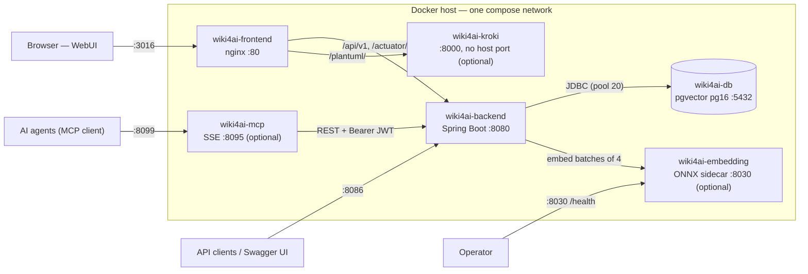

# Deployment & Operations

This document covers running, configuring, upgrading, backing up, and operating a wiki4ai instance. It is written against the dev stack on 192.168.77.219 (image `cbd10466`, schema V12) and the deployment artifacts in the repository (`docker-compose.yml`, `docker-compose.deploy.yml`, Dockerfiles, `.gitlab-ci.yml`, `scripts/`). All environment variables are listed by **name and default only** — no real secrets. For how the pieces fit together architecturally see [[Architecture Overview]]; for the REST surface behind the containers see [[Backend API Reference]].

## Container topology

A full wiki4ai stack consists of six containers on one Docker network. Three are required; three optional sidecars degrade gracefully when absent (see [Graceful degradation matrix](#graceful-degradation-matrix)).

| Container | Image | Host port | Purpose | Required? |
|---|---|---|---|---|
| `wiki4ai-db` | `pgvector/pgvector:pg16` | — (internal :5432) | PostgreSQL 16 + pgvector. Source of truth: users, tokens, projects, documents, embeddings, vault. | Yes |
| `wiki4ai-backend` | `git.keepee.duckdns.org/services/wiki4ai/backend:<tag>` | `8086→8080` (dev) | Spring Boot REST API; runs Flyway migrations on startup; issues JWTs. | Yes |
| `wiki4ai-frontend` | `git.keepee.duckdns.org/services/wiki4ai/frontend:<tag>` | `3016→80` (dev) | React SPA served by nginx, which also reverse-proxies `/api/v1`, `/actuator/` and `/plantuml/`. | Yes |
| `wiki4ai-embedding` | `git.keepee.duckdns.org/services/wiki4ai/embedding:<tag>` | `8030→8030` (dev) | Qwen3-Embedding-0.6B int8 ONNX sidecar (dim 1024, batch ≤ 4). Powers semantic search. | No — without it search is text-only |
| `wiki4ai-kroki` | `yuzutech/kroki:0.32.1` | — (internal :8000) | Stateless PlantUML renderer; nginx proxies `/plantuml/` to it, so no host port is exposed. | No — without it PlantUML blocks show an error card |
| `wiki4ai-mcp` | `git.keepee.duckdns.org/services/wiki4ai/mcp:<tag>` | `8099→8095` (dev) | MCP server (SSE transport) exposing the wiki API to AI agents. | No — WebUI is unaffected without it |

Host ports above are the dev (.219) convention; container ports (`80`, `8080`, `8030`, `8095`) are fixed and the host side can be remapped freely. The repo's local-dev compose (`docker-compose.yml`) instead exposes backend on `8080`, frontend on `80` and db on `5432`.



Notes on the wiring:

- **Frontend nginx is the only public entry point for the WebUI.** It serves the SPA, proxies `/api/v1` and `/actuator/` to the backend, and proxies `/plantuml/` to kroki. Since WIKI4AI-71 the proxy targets use Docker's embedded DNS resolver (`127.0.0.11`, `valid=10s`) so a restarted sidecar with a new IP becomes reachable again without an nginx reload.
- **db and kroki have no host ports** — they are reachable only from inside the compose network.
- The backend depends on db being *healthy* (`depends_on: condition: service_healthy`, `pg_isready`), not merely started.

## Quick start (Docker Compose)

### 1. Get the images

Images are built and pushed by the GitLab pipeline to `git.keepee.duckdns.org/services/wiki4ai/` on every push to `main` (see [Upgrades](#upgrades)). Pull with a registry login:

```bash
docker login git.keepee.duckdns.org
docker pull git.keepee.duckdns.org/services/wiki4ai/backend:<IMAGE_TAG>
docker pull git.keepee.duckdns.org/services/wiki4ai/frontend:<IMAGE_TAG>
docker pull git.keepee.duckdns.org/services/wiki4ai/embedding:<IMAGE_TAG>
docker pull git.keepee.duckdns.org/services/wiki4ai/mcp:<IMAGE_TAG>
docker pull pgvector/pgvector:pg16
docker pull yuzutech/kroki:0.32.1
```

`<IMAGE_TAG>` is a git short SHA (e.g. `cbd10466`) or the moving `latest` pointer.

### 2. Write the compose file

The example below mirrors the dev stack on .219 (structure verified there; all secret values are placeholders):

```yaml
services:
  db:
    image: pgvector/pgvector:pg16
    container_name: wiki4ai-db
    environment:
      POSTGRES_DB: wiki4ai
      POSTGRES_USER: wiki4ai
      POSTGRES_PASSWORD: <CHANGE_ME_db_password>
    volumes:
      - wiki4ai_pgdata:/var/lib/postgresql/data
    restart: unless-stopped
    healthcheck:
      test: ["CMD-SHELL", "pg_isready -U wiki4ai"]
      interval: 10s
      timeout: 5s
      retries: 5

  backend:
    image: git.keepee.duckdns.org/services/wiki4ai/backend:<IMAGE_TAG>
    container_name: wiki4ai-backend
    environment:
      SPRING_PROFILES_ACTIVE: postgres
      SPRING_DATASOURCE_URL: jdbc:postgresql://db:5432/wiki4ai
      SPRING_DATASOURCE_USERNAME: wiki4ai
      SPRING_DATASOURCE_PASSWORD: <CHANGE_ME_db_password>   # same value as POSTGRES_PASSWORD
      JWT_SECRET: <CHANGE_ME_long_random_string_64_plus_chars>
      EMBEDDING_BASE_URL: http://embedding:8030
      UPLOAD_DIR: /uploads
    volumes:
      - ./uploads:/uploads
    ports:
      - "8086:8080"
    depends_on:
      db:
        condition: service_healthy
    restart: unless-stopped

  frontend:
    image: git.keepee.duckdns.org/services/wiki4ai/frontend:<IMAGE_TAG>
    container_name: wiki4ai-frontend
    ports:
      - "3016:80"
    depends_on:
      - backend
    restart: unless-stopped

  # ── optional sidecars ────────────────────────────────────────────────
  embedding:   # semantic search; without it the instance still runs (text-only)
    image: git.keepee.duckdns.org/services/wiki4ai/embedding:<IMAGE_TAG>
    container_name: wiki4ai-embedding
    ports:
      - "8030:8030"
    mem_limit: 2560m
    healthcheck:
      test: ["CMD-SHELL", "python -c \"import urllib.request,sys; r=urllib.request.urlopen('http://127.0.0.1:8030/health', timeout=8); sys.exit(0 if r.status==200 else 1)\""]
      interval: 20s
      timeout: 10s
      start_period: 900s   # first start loads the ~614 MB model into ORT (minutes)
      retries: 15
    depends_on:
      - backend
    restart: unless-stopped

  kroki:       # PlantUML rendering; no host port — nginx proxies /plantuml/
    image: yuzutech/kroki:0.32.1
    container_name: wiki4ai-kroki
    mem_limit: 2g
    healthcheck:
      test: ["CMD-SHELL", "curl -fsS http://127.0.0.1:8000/health || exit 1"]
      interval: 30s
      timeout: 10s
      retries: 5
    restart: unless-stopped

  mcp-server:  # AI-agent access; MCP_JWT_TOKEN empty = open mode
    image: git.keepee.duckdns.org/services/wiki4ai/mcp:<IMAGE_TAG>
    container_name: wiki4ai-mcp
    environment:
      MCP_BASE_URL: http://wiki4ai-backend:8080/api
      MCP_JWT_TOKEN: <CHANGE_ME_mcp_sse_token_or_empty_for_open_mode>
    ports:
      - "8099:8095"
    depends_on:
      - backend
    restart: unless-stopped

volumes:
  wiki4ai_pgdata:
```

### 3. Start and do first-run setup

```bash
docker compose up -d
docker compose ps        # db must reach "healthy"; backend starts after that
```

Then open `http://<host>:3016` in a browser. A fresh instance has no accounts: the login route redirects to `/setup`, where the first account is created and becomes the administrator — after that the setup endpoint returns 403 forever. The full first-run flow (login, registration policy, admin-managed users) is documented in [[Getting Started]].

### Minimal vs full configuration

- **Minimal** (`db` + `backend` + `frontend`): everything works except semantic search and PlantUML rendering; no MCP access. This is the smallest useful stack.
- **Full** (+ `embedding`, `kroki`, `mcp-server`): hybrid (text + semantic) search with the "semantic search: active" badge, PlantUML diagrams rendered via kroki, and AI-agent access through the MCP server. This is what runs on .219.

Dev-stack deviations worth knowing: on .219 the frontend additionally mounts `./patch-nginx.sh` into `/docker-entrypoint.d/` — since WIKI4AI-46 that script is an intentional no-op (the CORS config now ships baked into the frontend image), kept only for historical reasons.

## Configuration reference

All configuration is passed as environment variables; there are no config files inside the containers. Defaults below come from `backend/src/main/resources/application.yml` / `application-postgres.yml`, the Dockerfiles, and the compose files — names and defaults only, never real values.

### Environment variables

| Variable | Default | Container | Description |
|---|---|---|---|
| `SPRING_PROFILES_ACTIVE` | unset (H2 in-memory dev mode) | backend | Must be `postgres` for any persistent instance — enables the Postgres datasource, Flyway migrations and `ddl-auto: validate`. |
| `SPRING_DATASOURCE_URL` | `jdbc:postgresql://db:5432/wiki4ai` (postgres profile) | backend | JDBC URL; host is the compose service name `db`. |
| `SPRING_DATASOURCE_USERNAME` | `wiki4ai` (postgres profile) | backend | DB user; must match `POSTGRES_USER`. |
| `SPRING_DATASOURCE_PASSWORD` | none — must be set | backend | DB password; must match `POSTGRES_PASSWORD` on the db service. |
| `SPRING_JPA_HIBERNATE_DDL_AUTO` | `validate` (postgres profile) | backend | All shipped compose files override this to `update`; schema itself is owned by Flyway. |
| `JWT_SECRET` | `your-secret-key-change-in-production` (insecure placeholder) | backend | HMAC secret for access + refresh JWTs. Must be a long random string; see [JWT secret & rotation](#jwt-secret--rotation). |
| `EMBEDDING_BASE_URL` | `http://localhost:8030` | backend | Base URL of the embedding sidecar; compose sets `http://embedding:8030`. When unreachable, search degrades to text-only (never a hard failure). |
| `UPLOAD_DIR` | `/uploads` | backend | Directory for user-uploaded images; bind-mount it to a host path (`./uploads`) or it is lost on container recreation. |
| `MULTIPART_MAX_FILE_SIZE` | `10MB` | backend | Max size of one uploaded file (images). |
| `MULTIPART_MAX_REQUEST_SIZE` | `12MB` | backend | Max size of the whole multipart request. |
| `ADMIN_INITIAL_USERNAME` | unset | backend | Opt-in non-interactive admin bootstrap; honored only while the users table is empty. See [Admin bootstrap](#admin-initial-username--admin-initial-password). |
| `ADMIN_INITIAL_PASSWORD` | unset | backend | Password for the opt-in bootstrap; same conditions as above. |
| `AUTH_REGISTRATION_OPEN` | unset (tri-state) | backend | Public self-registration policy. See [Registration policy](#auth_registration_open-tri-state). |
| `POSTGRES_DB` | — (set in compose: `wiki4ai`) | db | Database name created on first start. |
| `POSTGRES_USER` | — (set in compose: `wiki4ai`) | db | Superuser created on first start. |
| `POSTGRES_PASSWORD` | none — must be set | db | Password for `POSTGRES_USER`; must match `SPRING_DATASOURCE_PASSWORD`. |
| `PGDATA` | `/var/lib/postgresql/data` (image default) | db | Data directory; the .219 stack sets it explicitly. |
| `MCP_BASE_URL` | CLI default `http://localhost:8080/api` | mcp-server | Backend API base URL; compose sets `http://wiki4ai-backend:8080/api`. |
| `MCP_JWT_TOKEN` | empty (open mode) | mcp-server | Bearer credential required to reach the MCP SSE endpoint. See [MCP gated vs open](#mcp_jwt_token-gated-vs-open). |
| `EMBED_MAX_BATCH` | `4` | embedding | Max texts per `/embed` request (also the backend's batch size). |
| `EMBED_MAX_TOKENS` | `512` | embedding | Max tokens per input text; longer inputs are truncated. |

The frontend container takes **no** environment variables — its nginx configuration (SPA routing, `/api/v1`, `/plantuml/`, `/actuator/` proxies) is baked into the image at build time. The embedding image additionally bakes in `OMP_NUM_THREADS=2` and `MODEL_DIR=/models`; these are not runtime-configurable.

Fixed (non-environment) values that operators should know: access-token expiry **24 h** (`jwt.expiration: 86400000` ms), refresh-token expiry **7 d** (`jwt.refreshExpiration: 604800000` ms), embedding connect timeout **2 s** / read timeout **120 s** / "unavailable" cache TTL **15 s**, Hikari pool **max 20 connections** with a **60 s** leak-detection threshold (postgres profile), and actuator exposure limited to `health` + `info` with `show-details: always`.

### JWT_SECRET & rotation

`JWT_SECRET` signs both access tokens (24 h) and refresh tokens (7 d). The built-in default is a public placeholder — **replace it before any real deployment**. Rotation implications: the backend is stateless, so changing the secret does not invalidate anything on its own *until* tokens are re-validated against the new key — in practice **every existing access and refresh token becomes invalid immediately** and all users (and MCP clients using a stored JWT) must authenticate again. Keep the value stable across upgrades; store it only in the host compose file or environment, never in the repository.

### AUTH_REGISTRATION_OPEN (tri-state)

Controls `POST /api/v1/auth/register`:

| Value | Behavior |
|---|---|
| unset (default) | Open **only while no account exists** (first-run). Closes automatically with 403 once the first account is created. |
| `true` | Always open — explicit opt-in for public self-signup. |
| `false` | Never open — accounts only via first-run setup or the admin UI. |

The default "closed after first account" behavior is intentional (WIKI4AI-70); see [[Getting Started]] for the account lifecycle.

### ADMIN_INITIAL_USERNAME & ADMIN_INITIAL_PASSWORD

Strictly opt-in, non-interactive provisioning with **no defaults on purpose** (WIKI4AI-69): a fresh instance must never ship with publicly known credentials. When both are set *and* the users table is empty, the backend creates that user as `ADMIN` at startup and logs an INFO line. When either is unset, startup logs a prominent **WARN**:

> Initial admin bootstrap SKIPPED: admin.initial.username (env ADMIN_INITIAL_USERNAME) is not set. The instance starts uninitialized — create the first ADMIN account through the WebUI setup flow (POST /api/v1/auth/setup).

The values are honored only while the users table is empty; on an initialized instance they are ignored. Prefer the WebUI `/setup` flow unless you need unattended provisioning.

### MCP_JWT_TOKEN: gated vs open

`MCP_JWT_TOKEN` is the access credential for the MCP **SSE endpoint itself** (validated by Bearer auth middleware) — it is *not* a backend identity token, and the MCP server deliberately never forwards it to the wiki API (the backend would reject it with 401).

- **Gated mode (recommended for exposed instances):** set it to a random string; every MCP client must present it as `Authorization: Bearer <token>`.
- **Open mode:** leave it empty — anyone who can reach port 8095 can use the tools. Acceptable on a trusted LAN, not on a public interface.

See [[MCP Server]] for the full tool surface and client configuration.

### EMBEDDING_BASE_URL

Points the backend at the sidecar (`http://embedding:8030` inside the stack). The backend probes it with a 2 s connect timeout and caches an "unavailable" verdict for 15 s, so a downed sidecar costs at most one fast probe per search — search silently falls back to text-only matching (amber banner in the WebUI, see [[Search & Embeddings]]). There is no hard dependency: the service can be removed from compose entirely and the instance keeps working.

### DB credentials pattern

`POSTGRES_PASSWORD` (db) and `SPRING_DATASOURCE_PASSWORD` (backend) must carry the **same value**; `POSTGRES_USER`/`SPRING_DATASOURCE_USERNAME` default to `wiki4ai`. The db service creates the database, user and schema on first start into the named volume; changing credentials later requires recreating the volume (i.e. a fresh DB) or manual Postgres admin — plan the password at install time.

## Upgrades

### How releases work

Every push to `main` runs the GitLab pipeline (`.gitlab-ci.yml`), which has three stages:

1. **test** — `mvn test` (backend), TypeScript check + Vitest (frontend; ESLint intentionally not run yet), pytest (mcp-server). A red test gate stops the build before anything ships.
2. **build_and_push** — four Docker images (`backend`, `frontend`, `mcp`, `embedding`) built with BuildKit and pushed to `git.keepee.duckdns.org/services/wiki4ai/` under two tags: the **git short SHA** (immutable, e.g. `cbd10466`) and the moving **`latest`** pointer.
3. **deploy-to-server** — SSH into the dev box (.219), back up the stack's `compose.yaml` to `compose.yaml.bak-pipeline`, re-point the four image tags to the new SHA with `sed`, pull the four images, and run `docker compose up -d`. Production (.4) is **never** touched by the pipeline — deploying there is an explicit user decision only.

### Upgrade procedure

Pipeline-driven (the normal path): push a merge to `main` and watch the pipeline; the deploy job recreates only the services whose image changed. Manually:

```bash
docker login git.keepee.duckdns.org
docker pull git.keepee.duckdns.org/services/wiki4ai/backend:<NEW_SHA>   # + frontend/mcp/embedding as needed
# in the stack directory: edit the image tags in compose.yaml to <NEW_SHA>, then
docker compose up -d
docker compose ps
```

**Database migrations run automatically.** With `SPRING_PROFILES_ACTIVE=postgres`, Flyway (enabled, `classpath:db/migration`, `baseline-on-migrate`) applies any pending migration **before the backend starts accepting traffic**. The current release line is V1–V12 (schema creation → role column → refresh tokens → API tokens → vault tables → project hierarchy → document embeddings → document version → user language); the full table with per-version notes lives in [[Data Model]]. You never run migrations by hand.

### Rollback notes

- Rolling back an *image* is trivial: re-point the tags to the previous SHA and `docker compose up -d`.
- **Schema rollback is not.** Flyway migrations are forward-only — a rolled-back image does not undo V12, and with `ddl-auto` in validate/update mode an old codebase against a newer schema can fail at startup. If a release's migration turned out to be incompatible, the correct rollback is: restore the pre-upgrade backup (see [Backups](#backups)) onto the *new* image so Flyway re-applies cleanly, or keep the new image and fix forward.
- The pipeline's `compose.yaml.bak-pipeline` copy is a first-line rollback aid for compose-level mistakes.

### Zero-downtime vs brief-restart reality

This is a single-instance stack — there is no rolling upgrade. `docker compose up -d` recreates each changed container, so expect: the db **stays up** (its config never changes, so it is not recreated), the backend restarts for roughly 10–30 s (Spring Boot startup + any migrations), and frontend/mcp/embedding restart in seconds. In-flight requests during that window fail; browsers retry on reload. Plan upgrades outside working hours if the instance carries active users — but there is no data risk, since the database container and volume are untouched.

## Backups

### What to back up

1. **The Postgres volume (`wiki4ai_pgdata`) — the source of truth.** It holds users (BCrypt hashes), refresh tokens, API tokens, projects (including subproject hierarchy), documents with their versions, document embeddings (pgvector, 1024-dim), vault entries, and wiki links.
2. **The uploads directory** (`./uploads` on the host → `/uploads` in the backend container). User-uploaded images live here, *not* in the database; a backup without it loses images referenced by documents.

### Taking a backup

The repository ships `scripts/wiki4ai-db-backup.sh`, which runs on the target host and talks to the local Docker daemon:

```bash
./wiki4ai-db-backup.sh /mnt/backups        # → /mnt/backups/wiki4ai_<host>_<timestamp>.dump
```

It performs a `pg_dump --format=custom` inside the container, copies the file out with `docker cp`, and prints a summary (row counts of users/projects/documents + applied Flyway versions). The equivalent raw commands:

```bash
docker exec wiki4ai-db pg_dump -U wiki4ai -d wiki4ai --format=custom -f /tmp/wiki4ai.dump
docker cp wiki4ai-db:/tmp/wiki4ai.dump ./wiki4ai_$(date +%Y%m%d_%H%M%S).dump
```

Copy the dump **and** the uploads directory off-host (e.g. to another machine or object storage) — a backup on the same disk is not a backup.

### Restore procedure

`scripts/wiki4ai-db-restore.sh <dump> --yes-i-am-sure` (destructive — it wipes the current database) performs six steps: stop backend/mcp/frontend → terminate remaining DB connections → `DROP DATABASE` + `CREATE DATABASE` → `pg_restore --no-owner` → start the backend, **which runs any pending Flyway migrations automatically** (this is also the standard way to validate an upgrade path by restoring an older dump onto a newer image) → restart mcp/frontend. It finishes by printing the Flyway history and row counts so you can verify the result.

### RPO / RTO guidance

- **RPO:** schedule the backup script nightly (cron) → maximum 24 h of data loss. For a personal/team wiki that is usually sufficient; tighten to hourly if content churn is high.
- **RTO:** minutes. The restore script is fully automated and the db container stays up throughout; the dominant cost is restoring a large dump plus backend startup with migrations.

## Health & monitoring

### Per-service health endpoints

| Service | Endpoint | Auth | Verified response (dev .219) |
|---|---|---|---|
| backend (Spring) | `GET :8086/actuator/health` (also via frontend `:3016/actuator/health`) | none | `{"status":"UP","components":{"db":{"status":"UP",...},"diskSpace":{...},"ping":{"status":"UP"}}}` — details always shown |
| backend (API) | `GET /api/v1/health` | none | `{"application":"wiki4ai-backend","version":"0.0.1-SNAPSHOT","status":"UP"}` — this is what the MCP `health_check` tool calls |
| embedding | `GET :8030/health` | none | `{"status":"ok","model":"Qwen3-Embedding-0.6B-int8","dim":1024,"max_batch":4,"max_tokens":512}` |
| mcp-server | no HTTP `/health` (fastmcp SSE has none) — container healthcheck is a TCP connect to `:8095` | — | agents use the MCP `health_check` tool instead |
| kroki | internal only: `docker exec wiki4ai-kroki curl -fsS http://127.0.0.1:8000/health` (no host port) | none | HTTP 200 when healthy |
| db | compose healthcheck `pg_isready -U wiki4ai` (10 s interval) | — | shown as `healthy` in `docker compose ps` |

The WebUI doubles as a monitoring surface: the search pages show a green **semantic search: active** badge or an amber "Semantic search is unavailable" banner reflecting the embedding sidecar's state, and PlantUML blocks render or show an error card depending on kroki.

### Day-to-day commands

```bash
cd /mnt/data/docker/dockge/stacks/wiki4ai   # stack directory
docker compose ps                            # state + health of all six containers
docker logs --tail 100 wiki4ai-backend       # recent backend log (Spring Boot)
docker logs -f wiki4ai-backend               # follow live; look for "Started Wiki4AiApplication"
docker stats --no-stream                     # memory vs caps (embedding cap 2560m, kroki 2g)
docker compose restart embedding             # e.g. after an OOM or model hiccup
```

## Troubleshooting

| Symptom | Likely cause | Fix |
|---|---|---|
| Login fails with **401** right after an upgrade | `JWT_SECRET` changed between deploys — all access + refresh tokens are invalidated (stateless JWTs) | Keep `JWT_SECRET` stable across upgrades; users simply log in once. If the secret was lost, set a new one and expect everyone to re-authenticate. |
| PlantUML block shows **"PlantUML diagram not rendered"** (HTTP 502/504) | kroki container down, or first render slow (kroki spins up the PlantUML JVM on demand) | **Graceful by design** — Mermaid and everything else keep working. `docker start wiki4ai-kroki`, wait for `healthy`, reload the document. |
| Search page shows amber banner **"Semantic search is unavailable — showing text-only results."** | embedding sidecar down (or still loading the model after a restart) | **Graceful by design** — text search keeps working. Restart the sidecar; first start loads the ~614 MB model for minutes (healthcheck `start_period` is 900 s). Documents saved while it was down are filled in later via `POST /api/v1/admin/embeddings/backfill` (async, single-flight; progress at `GET .../backfill/status`). |
| `POST /api/v1/auth/register` returns **403** | Registration is closed after the first account exists (`AUTH_REGISTRATION_OPEN` unset) — **by design** | Create users in the Admin UI (`/admin/users`) or via the REST API, or set `AUTH_REGISTRATION_OPEN=true` to reopen public signup. |
| Backend crash-loops at startup with DB connection errors | Credential mismatch (`SPRING_DATASOURCE_PASSWORD` ≠ `POSTGRES_PASSWORD`) or db not ready yet | The `depends_on: service_healthy` guard normally prevents the race — check `docker compose ps` shows db `healthy`; verify both password values are identical. |
| `docker compose up` fails with **"bind: address already in use"** | Another container on the host already occupies 3016/8086/8099/8030 | Remap the host side of the port mapping (container ports stay fixed); find the squatter with `docker ps --format '{{.Names}} {{.Ports}}'`. |
| Backend fails to start after restoring an **older** schema dump | A newer Flyway migration conflicts with the restored data | Read `docker logs wiki4ai-backend` for the Flyway error, fix or re-restore a matching dump (see [Rollback notes](#rollback-notes)). |

## Graceful degradation matrix

wiki4ai is built so that only the database and backend are hard dependencies; every sidecar degrades gracefully:

| Component down | Still works | Degrades |
|---|---|---|
| **embedding** | Full text search, all CRUD, Mermaid *and* PlantUML diagrams, MCP | Semantic ranking gone — amber "text-only" banner on both search surfaces; documents saved during the outage are not embedded until a backfill runs |
| **kroki** | Everything else, including Mermaid (rendered client-side in the browser) | ` ```plantuml ` blocks show a red error card with the HTTP status and the raw source; rest of the document renders normally |
| **mcp-server** | The entire WebUI and REST API | AI agents lose wiki tools only; zero impact on human users |
| **backend** | Frontend still serves the static SPA shell | Every API call fails — effectively a full outage |
| **db** | nothing (backend refuses to start) | Full outage — this is the one true hard dependency |

## Security notes

- **Stateless JWTs, no server-side sessions.** Access tokens live 24 h; refresh tokens are persisted in the database (7 d) and are single-active per user — each login replaces the previously stored token, so a leaked refresh token stops working at the next login of that account.
- **Registration is closed by default** after the first account exists; all further accounts are admin-managed with an explicit `USER`/`ADMIN` role (WIKI4AI-70). Keep it that way unless you deliberately want public signup.
- **Run MCP in gated mode** on any instance reachable beyond a trusted LAN: set `MCP_JWT_TOKEN` so the SSE endpoint requires a Bearer credential. The MCP server authenticates to the backend with its own valid wiki JWT, so gate the transport, not the identity.
- **Secrets live in the host compose file / environment — never in the repository.** The repo's compose files ship placeholder defaults (`wiki4ai`/`wiki4ai`, `your-secret-key-change-in-production`) that exist for local development and must be replaced with `<CHANGE_ME>`-style values before any real deployment.
- **Rotate `JWT_SECRET` only deliberately** — it forces a re-login for every user and client (see [Troubleshooting](#troubleshooting)).
- Uploaded images are served **only to authenticated users** (login-only policy); anonymous visitors cannot fetch them even with the direct URL.
